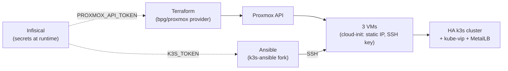
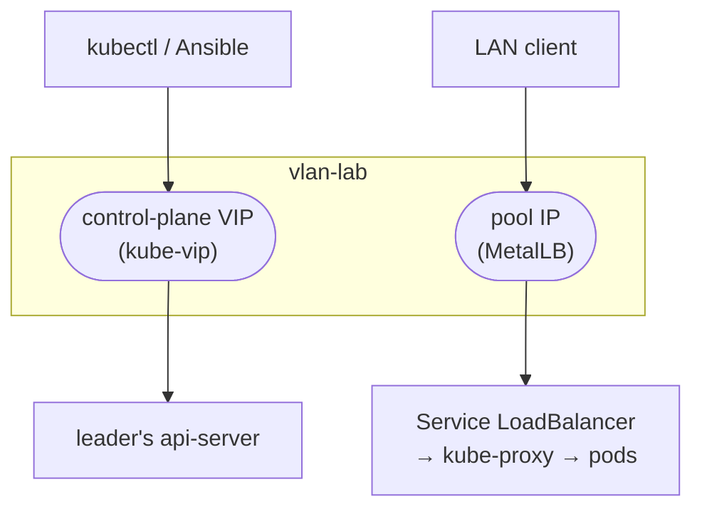

The [VFIO post]() closed the foundation arc: Proxmox, storage, network, GPU. Everything running in the homelab so far lives on **Docker hosts** (`willy`, `mobydick`, `encaged`), each with its composes, Portainer in front, watchtower updating images. It works, and it will keep working for what is platform infrastructure. But for **the applications I develop myself**, I wanted something else: a real Kubernetes cluster, provisioned 100% as code, to practice the whole model (quorum, drain, upgrades, GitOps) at home. This post is the first of three about that climb up the stack: here the cluster **stands up**.

<!--more-->

Tone warning, same as the VFIO one: this is not a copy-paste tutorial. It is the order of the decisions and the scars, with the code snippets that matter. I already had Kubernetes experience in the cloud (ingress, load balancers, Helm, ArgoCD), so what was new to me was not k8s — it was the **layer underneath**: getting Proxmox to hand over the VMs and the cluster to form itself, with no clicking.

## Why leave the single Docker host

Three reasons, in order of weight:

1. **Learn the model for real.** In the cloud, the load balancer, the dynamic storage and the control plane come ready-made and hidden. At home, every piece is assembled by hand, and that is where you understand what the provider was doing for you.
2. **Separate platform from application.** GitLab, Harbor, the vault, LGTM, the *arr stack: that is infra, it stays on the Docker hosts. What I develop is application, and applications deserve declarative deploys, rollbacks and a pipeline that finishes on its own.
3. **Blast radius.** A Docker host that dies takes everything with it. A 3-node cluster tolerates losing one and keeps writing.

And one boundary decision I made early: **GitLab and Harbor stay outside the cluster**. The cluster depends on them (pulls images, reads manifests), so putting both inside would create a circular dependency at rebuild time. Platform outside, applications inside.

## Decision 1: where the cluster lives

The cluster lives in **3 dedicated VMs** on `vlan-lab` (the isolated VLAN I described in the [first post]()). It is not the infra hosts' VLAN, it is the lab one, where I expose the things I am developing and take on controlled risk. That implies new plumbing on pfSense (rules for NFS and for Harbor, which live on other VLANs), but the isolation is worth the work: if one of my apps has a hole, it opens inside `vlan-lab`.

| VM | vCPU | RAM | Disk | Role |
|----|------|-----|------|------|
| `k3s-server-1` | 4 | 8 GB | 50 GB | control plane (etcd + API) and worker |
| `k3s-server-2` | 4 | 8 GB | 50 GB | control plane (etcd + API) and worker |
| `k3s-server-3` | 4 | 8 GB | 50 GB | control plane (etcd + API) and worker |
| VIP | | | | fixed control-plane address (kube-vip) |

The physical host has plenty of headroom (32 threads, 186 GB of RAM), so three 8 GB VMs squeeze nothing.

## Decision 2: 3 servers with embedded etcd (logical HA, not physical)

The heart of high availability is **etcd**, the key-value store where the cluster state lives. It uses Raft: the replicas elect a leader, and a write is only confirmed when the **majority** agrees.

```
majority = (N / 2) + 1
N = 3  → majority 2  → tolerates losing 1 node   (my case)
N = 2  → majority 2  → tolerates losing 0        (worse than 1 node, hence the odd number)
N = 5  → majority 3  → tolerates losing 2
```

With 3 servers, if 1 goes down the other 2 are still a majority and the cluster keeps writing. If 2 go down, quorum is lost and the API turns read-only until they return.

The honest part that needs to be on record: the 3 VMs run **on the same physical host**. That is **logical HA**: I learn quorum, drain and rolling upgrades with the right model, but the host remains a single point of failure. Physical HA would need a second Proxmox. For a study homelab, it is the right trade-off.

I made all 3 nodes control plane **and** worker at the same time (no dedicated agents). That is what makes sense for 3 VMs; if the cluster grows, agents come in later.

## Decision 3: infrastructure as code from day zero

No creating VMs in the Proxmox UI. The pipeline has three tools, each with a role that does not blend into the others:



- **Terraform provisions.** Creates the VMs from the Ubuntu cloud image. Has state, computes diffs. Stops at "VM exists and SSH answers".
- **Ansible configures.** Goes in over SSH and installs k3s, kube-vip and MetalLB. No state, idempotent.
- **Infisical injects the secrets.** The Proxmox API token and the cluster token never go into `tfvars`, never into `tfstate`, never onto disk: they enter as environment variables only for the duration of the command.

That last point deserves one more sentence. I evaluated the Infisical Terraform provider to read the Proxmox token as a data source, and discarded it: a data source writes the value **into the state**, in plaintext. With `infisical run` the secret only exists in the process environment. The `Makefile` handles it:

```makefile
INFISICAL = infisical run --env=prod --path=/k3s --

apply:
	cd terraform && $(INFISICAL) sh -c 'TF_VAR_proxmox_api_token="$$PROXMOX_API_TOKEN" terraform apply $(TF_ARGS)'
```

## Step 1: Terraform creates the VMs

The provider is `bpg/proxmox` (not `telmate`, which has been stale for a while). The structure is simple: download the cloud image once, create a resource pool, and bring up 3 VMs with `count`:

```hcl
resource "proxmox_download_file" "ubuntu_2404" {
  content_type = "import"
  datastore_id = "local"
  node_name    = var.proxmox_node
  url          = var.ubuntu_image_url
  file_name    = "ubuntu-24.04-server-cloudimg-amd64.qcow2"
}

resource "proxmox_virtual_environment_vm" "k3s_server" {
  count   = 3
  name    = "k3s-server-${count.index + 1}"
  pool_id = proxmox_virtual_environment_pool.k3s.pool_id

  cpu {
    cores = 4
    type  = "host"
  }

  memory {
    dedicated = 8192
  }

  disk {
    import_from = proxmox_download_file.ubuntu_2404.id
    interface   = "scsi0"
    size        = 50
  }

  initialization {
    ip_config {
      ipv4 {
        address = "${var.server_ips[count.index]}/24"
        gateway = var.gateway
      }
    }
    user_account {
      username = "ubuntu"
      keys     = [trimspace(var.ssh_public_key)]
    }
  }

  network_device {
    bridge  = var.network_bridge
    vlan_id = var.vlan_id
  }
}
```

The IPs of the 3 nodes (and the VIP) are **static via cloud-init** and must sit **outside the VLAN's DHCP range**, otherwise at some point pfSense hands the same address to another machine. I checked the DHCP server before choosing.

Three gotchas that only showed up on `apply`, the first two being provider version against Proxmox version:

- **`content_type = "iso"` fails** on VM creation ("wrong type iso - needs images or import"). For a cloud image on recent Proxmox, the type is **`import`**.
- **`import` validates the file extension**, and the Ubuntu cloud image ships as `.img`. It is qcow2 inside, so renaming via `file_name` to `.qcow2` is enough.
- **The provider SSHes into the host** for disk operations, and uses the **ssh-agent** (`agent = true`). The right key in `authorized_keys` is not enough: it has to be loaded into the agent (`ssh-add`), otherwise the apply fails with a perfectly valid key.

## Step 2: Ansible forms the cluster

First mistake, which cost an afternoon: I started with the official `k3s-io/k3s-ansible` playbook. It does HA with etcd, but **does not handle the VIP** or a load balancer. I switched to `techno-tim/k3s-ansible`, which does all three: embedded etcd, kube-vip and MetalLB.

Before running any third-party playbook with `become: true` on my VMs, I read the roles. The audit result, for the record: downloads only over HTTPS from official upstreams, k3s binary with checksum (not `curl | bash`), MetalLB and kube-vip images with pinned tags, root only does standard prep (sysctl, `br_netfilter`, systemd unit), does not disable the firewall, no telemetry. Two caveats: the repo's "stable" tag is from 2024, so I **pinned the master commit** I audited; and the only unpinned manifest (the kube-vip cloud provider) is only downloaded if you use kube-vip as the service load balancer, which I do not because MetalLB does that.

The inventory is an INI with 3 masters and no nodes:

```ini
[master]
<server-1-ip>
<server-2-ip>
<server-3-ip>

[node]

[k3s_cluster:children]
master
node
```

And `group_vars/all.yml`, only the lines that matter:

```yaml
k3s_version: v1.36.1+k3s1
ansible_user: ubuntu
flannel_iface: eth0                  # the VM's real NIC; Ubuntu cloud image uses eth0
apiserver_endpoint: <vip>            # the VIP kube-vip will hold
k3s_token: "{{ lookup('env', 'K3S_TOKEN') }}"   # comes from Infisical, not from the file

extra_server_args: >-
  --tls-san {{ apiserver_endpoint }}
  --disable servicelb               # MetalLB instead
  --disable traefik                 # ingress is my call, next post

kube_vip_arp: true
metal_lb_mode: layer2
metal_lb_ip_range: <start>-<end>     # outside DHCP and outside the node IPs
```

Running it is one line, wrapped in Infisical so the cluster token enters as a variable:

```bash
infisical run --env=prod --path=/k3s -- \
  ansible-playbook site.yml -i inventory/my-cluster/hosts.ini
```

### The bug that tore the cluster down after it came up

The cluster **came up**: 3 nodes Ready, VIP answering on `eth0`, `k3s.service` active. And then the playbook tore it all down.

What happened: the "Verify all nodes joined" task runs `kubectl get nodes` filtered by the label `node-role.kubernetes.io/master=true`. But Kubernetes **removed the `master` label in 1.24**; k3s 1.36 uses `control-plane`. The filter came back empty, the task retried 20 times, failed, and the role's `always` block killed the init service. Result: cluster formed and destroyed in the same run, with etcd still alive on disk.

The fix is one line in the role:

```yaml
# roles/k3s_server/tasks/main.yml
# before: -l 'node-role.kubernetes.io/master=true'
# after:  -l 'node-role.kubernetes.io/control-plane=true'
```

Since the patch lives in a clone, I made a **fork on my GitLab** with a `homelab` branch carrying just that commit, and pointed the infra repo's README at it. Updating from upstream later is `git fetch upstream && git rebase upstream/master`. Re-running the playbook after the fix converges: the cleanup tasks at the top of the role and the etcd on disk recover the state.

Two controller-side details (the laptop Ansible runs from): the playbook needs `netaddr`, `jmespath` and `kubernetes` in Python, and do **not** install the whole `requirements.txt`, because it pins an old `ansible-core` and downgrades yours. And the laptop must **reach `vlan-lab`** over WireGuard, which in my case meant adding the subnet to the peer's `AllowedIPs`.

## kube-vip and MetalLB: two floating IPs with different jobs

This is the part that confuses people coming from the cloud the most, because there both things come hidden inside "load balancer".

**kube-vip** handles the **control-plane VIP**. Without it, your `kubectl` points at a specific master; if that one dies, you lose the API even with etcd alive on the other two. kube-vip runs as a DaemonSet on the 3 servers, elects a leader, and the leader "holds" the VIP on the interface, announcing it via ARP. If the leader dies, another takes over and sends a gratuitous ARP: the address moves in seconds. That VIP is Ansible's `apiserver_endpoint` and is where the kubeconfig points.

**MetalLB** handles the **service IPs**. In the cloud, `Service type=LoadBalancer` makes the provider hand out an external IP. On bare metal there is no provider, and the Service stays `Pending` forever. MetalLB is that provider: a controller allocates an IP from the pool and a speaker on each node announces it on the network.



**L2** mode, which is what I use: one node is elected owner of each IP and answers ARP for it. It is failover, not balancing: all traffic for that IP enters through one node at a time. Real balancing would be BGP mode, which needs a router doing peering. For a homelab, L2 does the job, and the pool is finite (11 addresses), which pushes you toward the right pattern: **1 MetalLB IP for the ingress, N applications by hostname**. That is the next post.

To make it stick, the five address spaces that coexist in the cluster:

| Space | Routable? | Used by |
|-------|-----------|---------|
| Node IPs | on `vlan-lab` | the 3 VMs |
| VIP | on `vlan-lab` | control plane (kube-vip) |
| MetalLB pool | on `vlan-lab` | `LoadBalancer` Services |
| Pod CIDR (`10.42.0.0/16`, k3s default) | internal only | pods, via flannel (VXLAN) |
| Service CIDR (`10.43.0.0/16`, k3s default) | internal only | `ClusterIP` Services |

The first three are real on the network. The last two are virtual, they only exist inside the cluster.

## Step 3: laptop access through the VIP

k3s authenticates with a certificate embedded in the kubeconfig. Just pull it from the first node and swap `127.0.0.1` for the VIP:

```bash
ssh ubuntu@<server-1-ip> 'sudo cat /etc/rancher/k3s/k3s.yaml' > ~/.kube/homelab-k3s.yaml
sed -i '' 's#127.0.0.1#<vip>#' ~/.kube/homelab-k3s.yaml
KUBECONFIG=~/.kube/homelab-k3s.yaml kubectl get nodes -o wide   # 3 Ready
```

A hygiene detail I recommend: that kubeconfig lives in a **separate file**, and I never export `KUBECONFIG` globally in the shell. The same machine reaches work clusters, and a `kubectl delete` in the wrong context is the kind of mistake that only happens once.

## Node prerequisites (and the Terraform vs Ansible line in practice)

After the cluster forms, a small idempotent playbook installs two things on each node:

```yaml
- name: Install base packages
  ansible.builtin.apt:
    name:
      - nfs-common          # the kubelet mounts NFS PVs per pod; needs mount.nfs
      - qemu-guest-agent    # Proxmox sees the IP and does clean shutdowns
    state: present

- name: Enable qemu-guest-agent
  ansible.builtin.systemd:
    name: qemu-guest-agent
    enabled: true           # enabled only, not started (explained below)
```

`nfs-common` is for the dynamic storage in post 3. `qemu-guest-agent` is the perfect example of where one tool ends and the other begins: the **package** is configuration (Ansible), but the agent only works if the VM has the **virtio-serial channel**, and the channel is virtual hardware (Terraform, `agent { enabled = true }`). Both together to work. That is why the playbook only enables the service: it will start on its own once the channel exists.

And here lives the last gotcha of the post, the most important one operationally. Turning on `agent` in Terraform **reboots the VM inside the `apply` itself**. The 3 nodes are control plane and etcd at the same time. An `apply` without a target reboots all three together, and the cluster **loses quorum**. So every change that reboots a VM is applied **per node**, waiting for the previous one to come back:

```bash
for i in 0 1 2; do
  make apply TF_ARGS="-target=proxmox_virtual_environment_vm.k3s_server[$i]"
  kubectl wait --for=condition=Ready node/k3s-server-$((i+1)) --timeout=180s
done
```

That became a runbook in the repo's README. It is not optional good practice, it is what keeps the API up.

## The gotchas, as a checklist

- **Terraform fails on `apply` with an image type error** → `content_type = "import"`, and rename the cloud image to `.qcow2`.
- **Provider cannot SSH into the host, even with the right key** → the key must be in the ssh-agent (`ssh-add`).
- **Cluster comes up and the playbook tears it down** → `master` vs `control-plane` label in the verify task. One line.
- **`ansible-core` downgraded out of nowhere** → you installed the whole `requirements.txt`. Install only `netaddr jmespath kubernetes`.
- **Ansible cannot reach the nodes** → `vlan-lab` subnet in WireGuard's `AllowedIPs`.
- **API disappears after a `terraform apply`** → VM reboot without per-node `-target` broke quorum. Apply one node at a time.
- **`Service LoadBalancer` forever `Pending`** → MetalLB without a pool, or pool colliding with DHCP.

## What comes next in the series

The cluster is up: 3 nodes Ready, VIP answering, MetalLB handing out IPs, all reproducible with `make apply` and one `ansible-playbook`. But it is **empty**, and `kubectl apply` from my machine is no way to put an application in production. In the next post I close the loop: ingress with Gateway API and Traefik, ArgoCD reading from GitLab, Helm, Harbor as the registry and the Infisical operator so no secret ever touches Git. The cluster that updates itself.
