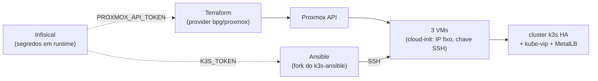
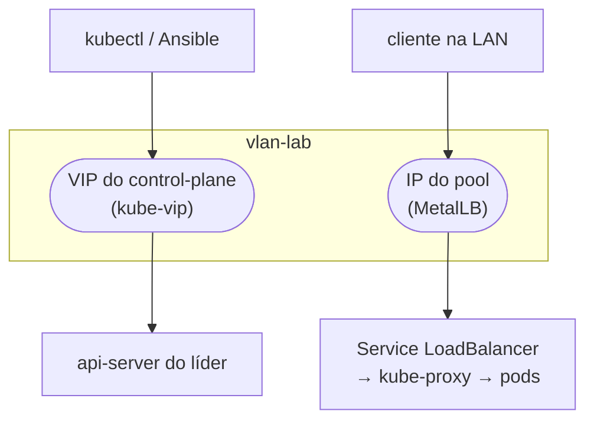

O [post do VFIO]() fechou o arco do chão: Proxmox, storage, rede, GPU. Tudo que roda no homelab até aqui vive em **hosts Docker** (`willy`, `mobydick`, `encaged`), cada um com seus composes, Portainer na frente, watchtower atualizando imagem. Funciona, e vai continuar funcionando pra o que é infra de plataforma. Mas pra **as aplicações que eu mesmo desenvolvo**, eu queria outra coisa: um cluster Kubernetes de verdade, provisionado 100% como código, pra praticar o modelo inteiro (quórum, drain, upgrade, GitOps) em casa. Esse post é o primeiro de três sobre essa subida de camada: aqui o cluster **fica de pé**.

<!--more-->

Aviso de tom, igual ao do VFIO: não é tutorial copia-e-cola. É a ordem das decisões e das cicatrizes, com os trechos de código que importam. Eu já tinha experiência com Kubernetes em cloud (ingress, load balancer, Helm, ArgoCD), então o que era novo pra mim não era o k8s, era a **camada de baixo**: fazer o Proxmox entregar as VMs e o cluster se formar sozinho, sem clique.

## Por que sair do host Docker único

Três motivos, em ordem de peso:

1. **Aprender o modelo de verdade.** Na cloud, o load balancer, o storage dinâmico e o control-plane vêm prontos e escondidos. Em casa, cada peça é montada à mão, e é aí que você entende o que o provider fazia por você.
2. **Separar plataforma de aplicação.** GitLab, Harbor, vault, LGTM, *arr stack: isso é infra, fica nos hosts Docker. O que eu desenvolvo é aplicação, e aplicação merece deploy declarativo, rollback e um pipeline que termina sozinho.
3. **Raio de explosão.** Um host Docker que morre leva tudo junto. Um cluster com 3 nós tolera perder 1 e segue escrevendo.

E uma decisão de fronteira que eu tomei cedo: **GitLab e Harbor ficam fora do cluster**. O cluster depende deles (puxa imagem, lê manifesto), então colocar os dois dentro criaria uma dependência circular na hora de reconstruir. Plataforma fora, aplicação dentro.

## Decisão 1: onde o cluster mora

O cluster vive em **3 VMs dedicadas** na `vlan-lab` (a VLAN isolada que eu descrevi no [primeiro post]()). Não é a VLAN dos hosts de infra, é a de laboratório, onde eu exponho as coisas que estou desenvolvendo e assumo risco controlado. Isso implica encanamento novo no pfSense (regras pra NFS e pro Harbor, que estão em outras VLANs), mas o isolamento vale o trabalho: se uma app minha tiver um buraco, ele abre dentro da `vlan-lab`.

| VM | vCPU | RAM | Disco | Papel |
|----|------|-----|-------|-------|
| `k3s-server-1` | 4 | 8 GB | 50 GB | control-plane (etcd + API) e worker |
| `k3s-server-2` | 4 | 8 GB | 50 GB | control-plane (etcd + API) e worker |
| `k3s-server-3` | 4 | 8 GB | 50 GB | control-plane (etcd + API) e worker |
| VIP | | | | endereço fixo do control-plane (kube-vip) |

O host físico tem folga de sobra (32 threads, 186 GB de RAM), então 3 VMs de 8 GB não apertam nada.

## Decisão 2: 3 servers com etcd embutido (HA lógica, não física)

O coração da alta disponibilidade é o **etcd**, o banco chave-valor onde mora o estado do cluster. Ele usa Raft: as réplicas elegem um líder, e uma escrita só é confirmada quando a **maioria** concorda.

```
maioria = (N / 2) + 1
N = 3  → maioria 2  → tolera perder 1 nó   (o meu caso)
N = 2  → maioria 2  → tolera perder 0      (pior que 1 nó, por isso número ímpar)
N = 5  → maioria 3  → tolera perder 2
```

Com 3 servers, se 1 cai os outros 2 ainda são maioria e o cluster continua escrevendo. Se 2 caem, perde quórum e a API vira somente leitura até voltar.

A honestidade que precisa ficar registrada: as 3 VMs rodam **no mesmo host físico**. Isso é **HA lógica**: eu aprendo quórum, drain e upgrade rolante com o modelo certo, mas o host continua sendo ponto único de falha. HA física exigiria um segundo Proxmox. Pra um homelab de estudo, é o trade-off certo.

Escolhi os 3 nós como control-plane **e** worker ao mesmo tempo (sem agents dedicados). É o que faz sentido pra 3 VMs; se o cluster crescer, agentes entram depois.

## Decisão 3: infra como código desde o dia zero

Nada de criar VM na UI do Proxmox. A pipeline tem três ferramentas, cada uma com um papel que não se mistura:



- **Terraform provisiona.** Cria as VMs a partir da cloud image do Ubuntu. Tem state, calcula diff. Para em "VM existe e SSH responde".
- **Ansible configura.** Entra via SSH e instala o k3s, o kube-vip e o MetalLB. Sem state, idempotente.
- **Infisical injeta os segredos.** O token da API do Proxmox e o token do cluster nunca vão pra `tfvars`, nunca vão pro `tfstate`, nunca vão pra disco: entram como variável de ambiente só durante o comando.

Esse último ponto merece uma frase a mais. Eu avaliei usar o provider Terraform do Infisical pra ler o token do Proxmox como data source, e descartei: data source grava o valor **no state**, em texto puro. Com `infisical run` o segredo só existe no ambiente do processo. O `Makefile` resolve isso:

```makefile
INFISICAL = infisical run --env=prod --path=/k3s --

apply:
	cd terraform && $(INFISICAL) sh -c 'TF_VAR_proxmox_api_token="$$PROXMOX_API_TOKEN" terraform apply $(TF_ARGS)'
```

## Passo 1: Terraform cria as VMs

O provider é o `bpg/proxmox` (não o `telmate`, que está parado há tempo). A estrutura é simples: baixa a cloud image uma vez, cria um pool de recursos, e sobe 3 VMs com `count`:

```hcl
resource "proxmox_download_file" "ubuntu_2404" {
  content_type = "import"
  datastore_id = "local"
  node_name    = var.proxmox_node
  url          = var.ubuntu_image_url
  file_name    = "ubuntu-24.04-server-cloudimg-amd64.qcow2"
}

resource "proxmox_virtual_environment_vm" "k3s_server" {
  count   = 3
  name    = "k3s-server-${count.index + 1}"
  pool_id = proxmox_virtual_environment_pool.k3s.pool_id

  cpu {
    cores = 4
    type  = "host"
  }

  memory {
    dedicated = 8192
  }

  disk {
    import_from = proxmox_download_file.ubuntu_2404.id
    interface   = "scsi0"
    size        = 50
  }

  initialization {
    ip_config {
      ipv4 {
        address = "${var.server_ips[count.index]}/24"
        gateway = var.gateway
      }
    }
    user_account {
      username = "ubuntu"
      keys     = [trimspace(var.ssh_public_key)]
    }
  }

  network_device {
    bridge  = var.network_bridge
    vlan_id = var.vlan_id
  }
}
```

Os IPs dos 3 nós (e o VIP) são **estáticos via cloud-init** e precisam ficar **fora da faixa de DHCP** da VLAN, senão em algum momento o pfSense entrega o mesmo endereço pra outra máquina. Conferi no DHCP server antes de escolher.

Três gotchas que só apareceram no `apply`, os dois primeiros de versão de provider contra versão de Proxmox:

- **`content_type = "iso"` falha** na criação da VM ("wrong type iso - needs images or import"). Pra cloud image em Proxmox recente, o tipo é **`import`**.
- **`import` valida a extensão** do arquivo, e a cloud image do Ubuntu vem como `.img`. Ela é qcow2 por dentro, então basta renomear via `file_name` pra `.qcow2`.
- **O provider faz SSH no host** pra operações de disco, e usa o **ssh-agent** (`agent = true`). Chave certa no `authorized_keys` não basta: ela precisa estar carregada no agent (`ssh-add`), senão o apply falha com a chave perfeitamente válida.

## Passo 2: Ansible forma o cluster

Primeiro erro, que custou uma tarde: comecei com o playbook oficial `k3s-io/k3s-ansible`. Ele faz HA com etcd, mas **não cuida de VIP** nem de load balancer. Troquei pelo `techno-tim/k3s-ansible`, que faz os três: etcd embutido, kube-vip e MetalLB.

Antes de rodar qualquer playbook de terceiro com `become: true` nas minhas VMs, eu li as roles. O resultado da auditoria, pra registro: downloads só por HTTPS de upstream oficial, binário do k3s com checksum (não é `curl | bash`), imagens do MetalLB e do kube-vip com tag fixa, root só faz preparo padrão (sysctl, `br_netfilter`, unit do systemd), não desliga firewall, sem telemetria. Duas ressalvas: a tag "estável" do repo é de 2024, então eu **fixei o commit** do master que auditei; e o único manifesto sem pin (o kube-vip cloud provider) só é baixado se você usar o kube-vip como load balancer de serviço, coisa que eu não uso porque o MetalLB faz isso.

O inventário é um INI com 3 masters e nenhum node:

```ini
[master]
<ip-do-server-1>
<ip-do-server-2>
<ip-do-server-3>

[node]

[k3s_cluster:children]
master
node
```

E o `group_vars/all.yml`, só as linhas que importam:

```yaml
k3s_version: v1.36.1+k3s1
ansible_user: ubuntu
flannel_iface: eth0                  # a NIC real da VM; cloud image do Ubuntu usa eth0
apiserver_endpoint: <vip>            # o VIP que o kube-vip vai segurar
k3s_token: "{{ lookup('env', 'K3S_TOKEN') }}"   # vem do Infisical, não do arquivo

extra_server_args: >-
  --tls-san {{ apiserver_endpoint }}
  --disable servicelb               # MetalLB no lugar
  --disable traefik                 # ingress é decisão minha, no próximo post

kube_vip_arp: true
metal_lb_mode: layer2
metal_lb_ip_range: <inicio>-<fim>    # fora do DHCP e fora dos IPs dos nós
```

Rodar é uma linha, embrulhada no Infisical pra o token do cluster entrar como variável:

```bash
infisical run --env=prod --path=/k3s -- \
  ansible-playbook site.yml -i inventory/my-cluster/hosts.ini
```

### O bug que derrubou o cluster depois de ele subir

O cluster **subiu**: 3 nós Ready, VIP respondendo no `eth0`, `k3s.service` ativo. E aí o playbook derrubou tudo.

O que aconteceu: a task "Verify all nodes joined" faz um `kubectl get nodes` filtrando pelo label `node-role.kubernetes.io/master=true`. Só que o Kubernetes **removeu o label `master` na 1.24**; k3s 1.36 usa `control-plane`. O filtro voltava vazio, a task tentava 20 vezes, falhava, e o bloco `always` do role matava o serviço de init. Resultado: cluster formado e destruído na mesma execução, com o etcd ainda vivo em disco.

O fix é uma linha na role:

```yaml
# roles/k3s_server/tasks/main.yml
# antes:  -l 'node-role.kubernetes.io/master=true'
# depois: -l 'node-role.kubernetes.io/control-plane=true'
```

Como o patch vive num clone, eu fiz um **fork no meu GitLab** com uma branch `homelab` carregando só esse commit, e apontei o README do repo de infra pra ele. Atualizar do upstream depois é `git fetch upstream && git rebase upstream/master`. Rodar o playbook de novo após o fix converge: as tasks de limpeza no topo do role e o etcd em disco recuperam o estado.

Dois detalhes do controlador (o laptop de onde o Ansible roda): o playbook precisa de `netaddr`, `jmespath` e `kubernetes` no Python, e **não** instale o `requirements.txt` inteiro, porque ele fixa uma versão antiga do `ansible-core` e rebaixa a sua. E o laptop precisa **alcançar a `vlan-lab`** pelo WireGuard, o que no meu caso exigiu adicionar a sub-rede no `AllowedIPs` do peer.

## kube-vip e MetalLB: dois IPs flutuantes com papéis diferentes

Essa é a parte que mais confunde quem vem de cloud, porque lá as duas coisas vêm escondidas dentro de "load balancer".

**kube-vip** cuida do **VIP do control-plane**. Sem ele, o seu `kubectl` aponta pra um master específico; se aquele cai, você perde a API mesmo com o etcd vivo nos outros dois. O kube-vip roda como DaemonSet nos 3 servers, elege um líder, e o líder "segura" o VIP na interface, anunciando por ARP. Se o líder cai, outro assume e manda um gratuitous ARP: o endereço migra em segundos. Esse VIP é o `apiserver_endpoint` do Ansible e é pra onde o kubeconfig aponta.

**MetalLB** cuida dos **IPs dos serviços**. Na cloud, `Service type=LoadBalancer` faz o provider entregar um IP externo. Em bare-metal não existe provider, e o Service fica `Pending` pra sempre. O MetalLB é esse provider: um controller aloca um IP do pool e um speaker em cada nó anuncia o IP na rede.



Modo **L2**, que é o que eu uso: um nó é eleito dono de cada IP e responde ARP por ele. É failover, não balanceamento: todo o tráfego daquele IP entra por um nó de cada vez. Balanceamento real seria o modo BGP, que precisa de roteador fazendo peering. Pra um homelab, L2 resolve, e o pool é finito (11 endereços), o que empurra pro padrão certo: **1 IP do MetalLB pro ingress, N aplicações por hostname**. Isso é assunto do próximo post.

Pra fixar, os cinco espaços de endereço que convivem no cluster:

| Espaço | Roteável? | Quem usa |
|--------|-----------|----------|
| IPs dos nós | na `vlan-lab` | as 3 VMs |
| VIP | na `vlan-lab` | control-plane (kube-vip) |
| Pool do MetalLB | na `vlan-lab` | Services `LoadBalancer` |
| Pod CIDR (`10.42.0.0/16`, default do k3s) | só interno | pods, via flannel (VXLAN) |
| Service CIDR (`10.43.0.0/16`, default do k3s) | só interno | Services `ClusterIP` |

Os três primeiros são reais na rede. Os dois últimos são virtuais, só existem dentro do cluster.

## Passo 3: acesso do laptop pelo VIP

O k3s autentica com certificado embutido no kubeconfig. É só puxar do primeiro nó e trocar o `127.0.0.1` pelo VIP:

```bash
ssh ubuntu@<ip-do-server-1> 'sudo cat /etc/rancher/k3s/k3s.yaml' > ~/.kube/homelab-k3s.yaml
sed -i '' 's#127.0.0.1#<vip>#' ~/.kube/homelab-k3s.yaml
KUBECONFIG=~/.kube/homelab-k3s.yaml kubectl get nodes -o wide   # 3 Ready
```

Detalhe de higiene que eu recomendo: esse kubeconfig vive num **arquivo separado**, e eu nunca exporto `KUBECONFIG` global no shell. A mesma máquina acessa clusters de trabalho, e um `kubectl delete` no contexto errado é o tipo de erro que só acontece uma vez.

## Os pré-requisitos de nó (e a diferença entre Terraform e Ansible na prática)

Depois do cluster formado, um playbook pequeno e idempotente instala duas coisas em cada nó:

```yaml
- name: Install base packages
  ansible.builtin.apt:
    name:
      - nfs-common          # o kubelet monta PV NFS por pod; precisa do mount.nfs
      - qemu-guest-agent    # Proxmox enxerga o IP e faz shutdown limpo
    state: present

- name: Enable qemu-guest-agent
  ansible.builtin.systemd:
    name: qemu-guest-agent
    enabled: true           # só enabled, não started (explico abaixo)
```

O `nfs-common` é pro storage dinâmico do post 3. O `qemu-guest-agent` é o exemplo perfeito de onde termina uma ferramenta e começa a outra: o **pacote** é configuração (Ansible), mas o agente só funciona se a VM tiver o **canal virtio-serial**, e o canal é hardware virtual (Terraform, `agent { enabled = true }`). Os dois juntos pra funcionar. Por isso o playbook só habilita o serviço: ele vai subir sozinho quando o canal existir.

E aqui mora o último gotcha do post, que é o mais importante operacionalmente. Ligar o `agent` no Terraform **reinicia a VM dentro do próprio `apply`**. Os 3 nós são control-plane e etcd ao mesmo tempo. Um `apply` sem target reinicia os três juntos, e o cluster **perde quórum**. Então toda mudança que reinicia VM é aplicada **por nó**, esperando o anterior voltar:

```bash
for i in 0 1 2; do
  make apply TF_ARGS="-target=proxmox_virtual_environment_vm.k3s_server[$i]"
  kubectl wait --for=condition=Ready node/k3s-server-$((i+1)) --timeout=180s
done
```

Isso virou runbook no README do repo. Não é boa prática opcional, é o que mantém a API de pé.

## Os gotchas, em forma de checklist

- **Terraform falha no `apply` com erro de tipo da imagem** → `content_type = "import"`, e renomeia a cloud image pra `.qcow2`.
- **Provider não consegue SSH no host, mesmo com a chave certa** → a chave precisa estar no ssh-agent (`ssh-add`).
- **Cluster sobe e o playbook derruba** → label `master` vs `control-plane` na task de verify. Uma linha.
- **`ansible-core` rebaixado do nada** → você instalou o `requirements.txt` inteiro. Instale só `netaddr jmespath kubernetes`.
- **Ansible não alcança os nós** → sub-rede da `vlan-lab` no `AllowedIPs` do WireGuard.
- **API some depois de um `terraform apply`** → reinício de VM sem `-target` por nó derrubou o quórum. Aplicar um nó de cada vez.
- **`Service LoadBalancer` eternamente `Pending`** → MetalLB sem pool, ou pool colidindo com DHCP.

## O que vem na série

O cluster está de pé: 3 nós Ready, VIP respondendo, MetalLB entregando IP, tudo reproduzível com `make apply` e um `ansible-playbook`. Mas está **vazio**, e `kubectl apply` da minha máquina não é jeito de colocar aplicação em produção. No próximo post eu fecho o loop: ingress com Gateway API e Traefik, ArgoCD lendo do GitLab, Helm, Harbor como registry e o operator do Infisical pra nenhum segredo encostar no Git. O cluster que se atualiza sozinho.
