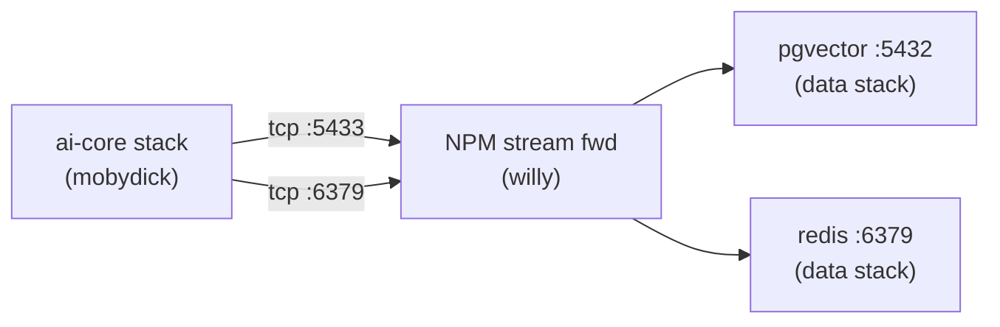
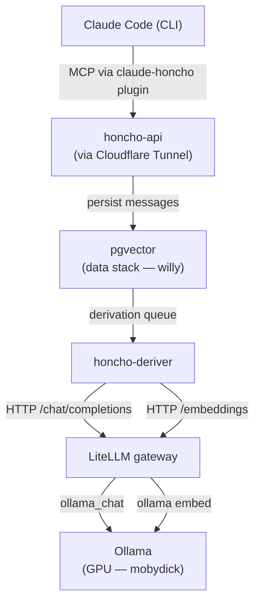

In the [first post]() of this series I covered the homelab's ground floor (Proxmox, VMs, VLANs, passthrough). In the [second]() I told the story of what got me writing this blog: the self-hosted semantic memory I wired into my agents. This one opens the lens: the **whole AI stack** that lives on top of that floor, and why each piece sits where it does.

<!--more-->

## Why self-host LLMs

I've used the vast majority of the AI providers on the market. Today almost nothing I do with an LLM leaves the homelab, and when it does, I use hybrid infra with cost management and token control. Three reasons, in order of weight:

1. **Data.** Conversations, work code, what I'm studying — I don't want them passing through a third party's API. Even with a "we don't train on your data" clause, the principle is simple: if I can run it locally, I run it locally.
2. **Cost.** API call by API call is cheap. API call × a thousand/day, every day, for an agent that iterates, **isn't**. Amortized hardware almost always wins when usage is constant.
3. **Learning.** Getting your hands on AI infra is where the interesting part lives. Every detail I research and every problem I solve here is knowledge nobody sells.

And the fourth, honest one: building things is fun.

## Where it lives — `mobydick`, a beefy cluster just for Docker

Inference needs a GPU. I have a consumer-grade NVIDIA GPU — not the best card in the world, but it runs models well enough to handle my workloads. It's passed via **PCIe passthrough (VFIO)** from Proxmox straight to a dedicated VM: `mobydick`. That VM is just a Docker host, no UI, no media server sharing the GPU. Only the AI stack. The flow of getting VFIO right for this gets its own post in this series (still a work in progress, it's a whole article on its own).

Choosing to isolate AI on an exclusive VM was intentional:

- The GPU is shared **in time**, not in space. When I need the card on another VM (whether Windows for gaming, Kali for labs, or anything else), the [hookscript](#decision-4--rotating-gpu-passthrough-and-a-hookscript-so-i-dont-shoot-myself-in-the-foot) takes `mobydick` down first.
- If I corrupt something experimenting with a new model, I restore just `mobydick` from PBS. The rest of the homelab doesn't even feel it.
- Its Docker daemon is dedicated, with no CPU contention against NPM, Pi-hole and company.

## The components of the `ai-core` stack

Inside `mobydick`, a single `docker-compose` called `ai-core` orchestrates:

| Service                | Role                                                                                                                                                                                    |
| ---------------------- | -------------------------------------------------------------------------------------------------------------------------------------------------------------------------------------- |
| **Ollama**             | Local model runtime (deepseek-r1, qwen3, nomic-embed-text, gemma3...)                                                                                                                   |
| **LiteLLM gateway**    | OpenAI-compatible layer that aliases every model (`local-fast`, `local-smart`, `local-reason`, `local-code`, `local-vision`, `local-embed`) and centralizes budget/RPM per virtual key  |
| **Honcho**             | Semantic memory for agents — `honcho-api` (REST + MCP) and `honcho-deriver` (processes the fact queue)                                                                                  |
| **ComfyUI / speaches** | Image and voice, completing the trio an LLM alone doesn't cover                                                                                                                         |

Why this combination instead of each service on a dedicated VM? Affinity: all of these services need to talk to the GPU. Keeping them on the same Docker host eliminates network hops for inference. The split that makes sense is **per host (with/without GPU)**, not per service.

## Cross-host — where the `data` stack comes in

`mobydick` needs **Postgres** (pgvector for Honcho's embeddings) and **Redis** (LiteLLM's cache). Those two pieces don't run on `mobydick`, they run on the `willy` VM (the infra Docker VM I introduced in the [first post]()), inside the `data` stack:

There's no overlay network crossing VMs. **Stream forwarding** in `willy`'s Nginx Proxy Manager does the job: `mobydick` connects to the port NPM exposes and NPM forwards to the pgvector inside the `data` stack. Same thing for Redis.

Why separate storage from AI compute?

- **Reuse**: pgvector already existed for other services (`bytebase`, and future projects). Honcho just plugged in.
- **Backup**: PBS snapshots all of `willy` together, without mixing in 200 GB of model weights that don't need a daily backup.
- **Independent restart**: I can restart the whole `ai-core` without taking Postgres down.

## The end-to-end pipeline

Putting it all together — the full cycle when I send a message to Claude Code:

Each message is persisted in Honcho, derived into facts by a local LLM (`local-deriver` = deepseek-r1:8b), and indexed as a 768d embedding (`local-embed` = nomic-embed-text) in pgvector. When a new session opens, Honcho gives me back relevant memory via semantic retrieval.

**Zero cloud dependency** on the inference path. The only cloud points left are GitHub (for `git pull` of the configs repo) and Cloudflare (tunnel + DNS).

## Why LiteLLM in the middle

I could connect Honcho straight to Ollama. It works. But LiteLLM solves four things at once:

1. **OpenAI-compatible interface** — any client that speaks OpenAI talks to my local models without changing a line.
2. **Stable aliases** — when I swap `qwen3:14b` for `qwen4:14b` three months from now, `local-smart` is still `local-smart`. The client doesn't need to know.
3. **Virtual keys with budgets** — one key for Open WebUI ($5/month), another for Honcho (RPM 60). Usage auditing per consumer.
4. **Fallback / routing** — eventually I can put the Claude API behind the same gateway, with automatic fallback. Same interface.

It's the piece that makes the stack **extensible**.

## What's coming in the series

This was the **map**. The next posts dive into concrete pieces of it:

- **GPU passthrough via VFIO** — what's under the `passthrough` mentioned here: IOMMU groups, vfio-pci, VM-to-VM contention. (Work in progress.)
- **LiteLLM as a gateway** — minimal YAML config, virtual keys, aliases, Redis cache integration.
- **Open WebUI wired to LiteLLM** — closing the loop for a ChatGPT-like UI that's 100% local.

And what's already up in this series:

- **[Building the homelab — the decisions that hurt]()** — the floor that made this stack possible.
- **[Running Honcho self-hosted — the gotchas that cost me hours]()** — 768 vs 1536 embeddings, `REDIS_PASSWORD` with a `#`, Cloudflare Access vs JWT.

If you only have the bandwidth to start with one piece after bringing the homelab up, start with the **gateway** (LiteLLM). It gives you the stable interface that saves you from rework when you later swap runtime, model, or provider.
