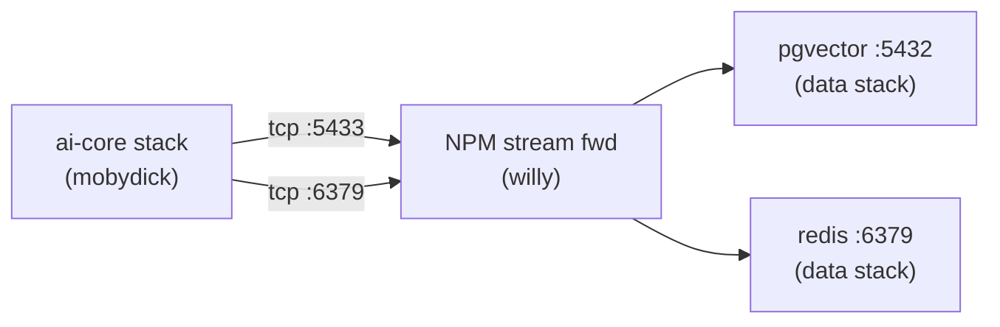
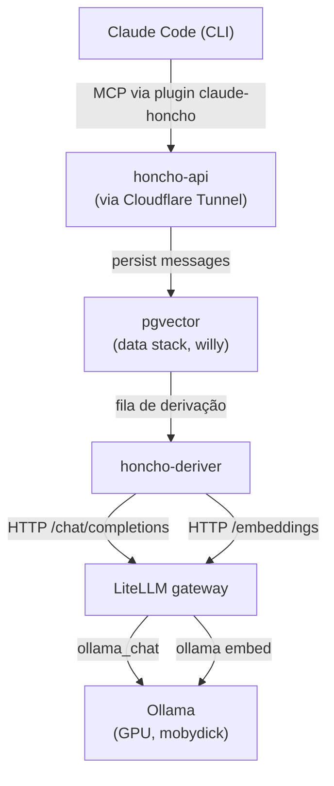

No [primeiro post]() dessa série eu falei do chão do homelab (Proxmox, VMs, VLANs, passthrough). No [segundo]() eu contei o que me trouxe pra escrever esse blog: a memória semântica self-hosted que liguei aos meus agents. Esse aqui abre a câmera: o **stack inteiro de IA** que vive em cima desse chão, e por que cada peça está onde está.

<!--more-->

## Por que self-host LLMs

Eu já usei a grande maioria de provedores de IA de mercado. Hoje quase nada do que eu faço com LLM sai do homelab e se sair eu uso infraestrutura hibrida com gestão de custo e controle de tokens. Três razões, em ordem de peso:

1. **Dados.** Conversas, código de trabalho, o que eu estudo, não quero passando por API de terceiro. Mesmo com cláusula de "não treinamos com seus dados", o princípio é simples: se posso rodar local, rodo local.
2. **Custo.** API call por API call é barato. API call × mil/dia, todo dia, pra agente que itera, **não é**. Hardware amortizado quase sempre ganha quando o uso é constante.
3. **Aprender.** Pôr a mão na infra de IA é onde mora a parte interessante. Cada detalhe que pesquiso e cada problema que eu resolvo aqui é conhecimento que ninguém vende.

E o quarto, honesto: é divertido construir as coisas.

## Onde mora: `mobydick`, cluster parrudo só pra Docker

A inferência precisa de GPU. Tenho uma GPU NVIDIA de linha consumer, não é a placa do mundo, mas roda modelo o bastante pra segurar minhas cargas de trabalho. Ela é passada via **PCIe passthrough (VFIO)** do Proxmox direto pra uma VM dedicada: `mobydick`. Essa VM é só Docker host, nada de UI, nada de servidor de mídia compartilhando GPU. Só o stack de IA. O fluxo de configurar VFIO direito pra isso fica em post próprio nessa série (ainda em construção, é assunto pra um texto inteiro).

A escolha de isolar AI numa VM exclusiva foi proposital:

- A GPU é compartilhada **no tempo**, não no espaço. Quando preciso da placa em outra VM (seja Windows pra jogar, Kali pra labs, ou qualquer outra finalidade), o [hookscript](#decisão-4-passthrough-de-gpu-rotativo-e-um-hookscript-pra-não-dar-tiro-no-pé) derruba `mobydick` primeiro.
- Se eu corromper algo experimentando com modelo novo, restauro só `mobydick` do PBS. Resto do homelab nem sente.
- O Docker daemon dela é dedicado, sem disputa por CPU com NPM, Pi-hole e companhia.

## Os componentes do stack `ai-core`

Dentro do `mobydick`, um único `docker-compose` chamado `ai-core` orquestra:

| Serviço                | Papel                                                                                                                                                                                   |
| ---------------------- | --------------------------------------------------------------------------------------------------------------------------------------------------------------------------------------- |
| **Ollama**             | Runtime de modelos locais (deepseek-r1, qwen3, nomic-embed-text, gemma3...)                                                                                                             |
| **LiteLLM gateway**    | Camada OpenAI-compatible que aliasa todos os modelos (`local-fast`, `local-smart`, `local-reason`, `local-code`, `local-vision`, `local-embed`) e centraliza budget/RPM por virtual key |
| **Honcho**             | Memória semântica pra agentes: `honcho-api` (REST + MCP) e `honcho-deriver` (processa fila de fatos)                                                                                   |
| **ComfyUI / speaches** | Imagem e voz, completando o trio que LLM sozinho não cobre                                                                                                                              |

Por que essa combinação e não cada serviço numa VM dedicada? Afinidade: todos esses serviços precisam falar com a GPU. Mantê-los no mesmo Docker host elimina hops de rede pra inferência. A separação que faz sentido é **por host (com/sem GPU)**, não por serviço.

## Cross-host: onde o `data` stack entra

`mobydick` precisa de **Postgres** (pgvector pra embeddings do Honcho) e **Redis** (cache do LiteLLM). Essas duas peças não rodam no `mobydick`, rodam na VM `willy` (a VM Docker de infra que apresentei no [primeiro post]()), dentro do stack `data`:

Não tem overlay network atravessando VMs. **Stream forwarding** no Nginx Proxy Manager do `willy` faz o papel: o `mobydick` conecta na porta exposta pelo NPM e o NPM redireciona pro pgvector dentro do stack `data`. Mesma coisa pro Redis.

Por que separar storage do compute de IA?

- **Reuso**: o pgvector já existia pra outros serviços (`bytebase`, e futuros projetos). Honcho só se plugou.
- **Backup**: PBS faz snapshot do `willy` inteiro junto, sem misturar com 200 GB de model weights que não precisam de backup todo dia.
- **Restart independente**: posso restartar o `ai-core` inteiro sem derrubar Postgres.

## O pipeline end-to-end

Juntando tudo, o ciclo completo quando eu mando uma mensagem pro Claude Code:

Cada mensagem persiste no Honcho, é derivada em fatos por um LLM local (`local-deriver` = deepseek-r1:8b), e indexada como embedding 768d (`local-embed` = nomic-embed-text) no pgvector. Quando uma sessão nova abre, o Honcho devolve memória relevante via retrieval semântico.

**Zero cloud dependency** no caminho de inferência. Os únicos pontos cloud que sobraram são GitHub (pra `git pull` do repo de configs) e Cloudflare (tunnel + DNS).

## Por que o LiteLLM no meio

Eu podia conectar Honcho direto no Ollama. Funciona. Mas o LiteLLM resolve quatro coisas de uma vez:

1. **OpenAI-compatible interface**: qualquer cliente que fala OpenAI fala com meus modelos locais sem mudar uma linha.
2. **Aliases estáveis**: quando eu trocar `qwen3:14b` por `qwen4:14b` daqui 3 meses, `local-smart` continua sendo `local-smart`. Cliente não precisa saber.
3. **Virtual keys com budget**: uma key pro Open WebUI ($5/mês), outra pro Honcho (RPM 60). Auditoria de uso por consumidor.
4. **Fallback / roteamento**: eventualmente posso colocar Claude API atrás do mesmo gateway, com fallback automático. Mesma interface.

É a peça que torna o stack **extensível**.

## O que vem na série

Esse foi o **mapa**. Os próximos posts mergulham em peças concretas dele:

- **GPU passthrough via VFIO**: o que tem por baixo do `passthrough` mencionado aqui: IOMMU groups, vfio-pci, conflito entre VMs. (Em construção.)
- **LiteLLM como gateway**: config mínima em YAML, virtual keys, aliases, integração com Redis cache.
- **Open WebUI ligado no LiteLLM**: fechando o loop pra ter ChatGPT-like UI 100% local.

E o que já está no ar nessa série:

- **[Montando o homelab: as decisões que doeram]()**: o chão que tornou esse stack possível.
- **[Rodando Honcho self-hosted: os gotchas que custaram horas]()**: embedding 768 vs 1536, `REDIS_PASSWORD` com `#`, Cloudflare Access × JWT.

Se você só tem fôlego pra começar por uma peça depois de subir o homelab, comece pelo **gateway** (LiteLLM). Ele te dá a interface estável que vai te poupar de retrabalho quando você for trocar runtime, modelo, ou provider mais pra frente.
