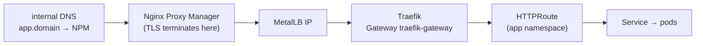
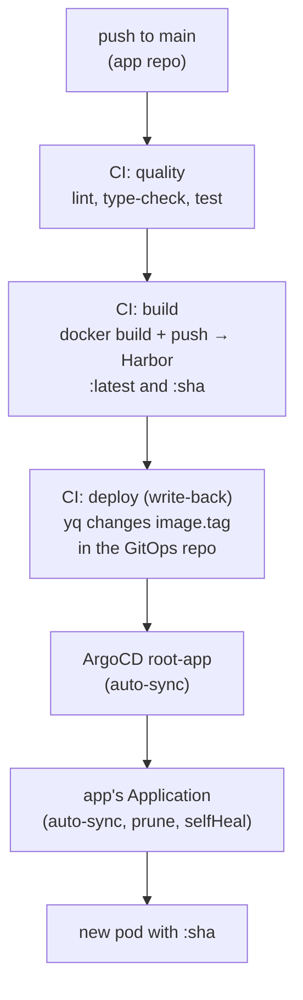

In the [previous post]() the cluster stood up: 3 nodes, VIP, MetalLB, all as code. But an empty cluster is just an electricity bill. This post's question is **how one of my applications gets in there** without me running `kubectl apply` from the laptop, and how it updates when I merge to `main`. The answer has five pieces: an ingress, ArgoCD, Helm, a registry, and a way to bring secrets into the cluster without them ever touching Git.

<!--more-->

The order here is the order I built it in, because each piece assumes the previous one. First traffic gets in, then deploys become declarative, then images have somewhere to come from, finally the secrets.

## Piece 1: ingress with Gateway API and Traefik (not `Ingress`)

I was going to install `ingress-nginx` by reflex, since that is what I always used in the cloud. I went to check the version and found the project **was retired in March 2026** (repo archived, no security patches), and the announced successor did not take off. The official Kubernetes path today is the **Gateway API**, GA since 2023, and the controller I picked was **Traefik v3**: light, native to the k3s ecosystem, and with full Gateway API support.

k3s ships a bundled Traefik, but I turned it off (`--disable traefik` in the previous post's Ansible) on purpose: I wanted the version I chose, installed via Helm, with versioned values.

```bash
kubectl apply --server-side -f \
  https://github.com/kubernetes-sigs/gateway-api/releases/download/v1.5.1/standard-install.yaml

helm install traefik traefik/traefik -n traefik --create-namespace \
  --version 40.3.0 \
  --set providers.kubernetesGateway.enabled=true
```

The Gateway API mental model is what `Ingress` used to blend together: the **`Gateway`** is the listener (infra, belongs to whoever operates the cluster), and the **`HTTPRoute`** is the per-hostname rule (application, lives in its namespace). The chart already creates the `traefik-gateway` `Gateway` with a `web` listener, and its Service is a `LoadBalancer`: MetalLB hands out **one** pool IP, and that IP is the front door for **every** application. A new app does not consume an IP, it just adds an `HTTPRoute` with its hostname.

A gotcha that cost half an hour: the default `Gateway` only accepts routes from **its own namespace** (`allowedRoutes.namespaces.from: Same`). For each app to have its `HTTPRoute` in its own namespace, that becomes `All`. And it must be via the **chart values**, not `kubectl patch` on the object: a future `helm upgrade` would revert the patch and you would only find out when an app vanished.

```yaml
gateway:
  listeners:
    web:
      namespacePolicy:
        from: All
```

TLS is **not** in the cluster. It terminates at Nginx Proxy Manager, which already existed on `vlan-core` with the wildcard certificate for the internal domain, and from there traffic goes over HTTP to Traefik's IP. No cert-manager, no extra place to renew certificates. The pattern for exposing any app ended up like this:



NPM preserves the `Host` header, Traefik matches the right `HTTPRoute`. One more pfSense rule (NPM's VLAN reaching Traefik's IP) and done.

## Piece 2: ArgoCD and the app-of-apps pattern

ArgoCD also comes in via Helm, in **insecure mode** (HTTP) because TLS belongs to NPM: `configs.params."server.insecure"=true`. The initial admin password sits in a Secret generated at install; I changed it in the UI and **deleted the Secret** right after, there is no reason for it to keep existing.

The desired-state repository structure is the simplest thing that works, **app-of-apps**:

```
homelab-gitops/
├── bootstrap/root-app.yaml   # the "root" Application, which creates all the others
└── apps/
    ├── traefik.yaml          # Helm Application (upstream chart + values)
    ├── nfs-subdir.yaml       # same
    └── <my-app>.yaml         # Application pointing at the chart in the app's repo
```

`root` watches the `apps/` folder with automated sync (`prune` and `selfHeal` on). Adding an application is committing a file to `apps/`. The only manual touch, once in the cluster's life, is `kubectl apply -f bootstrap/root-app.yaml`.

One detail I found important: Traefik and the storage provisioner **were already running**, installed by hand via Helm. Instead of reinstalling, I **adopted** them: the Application uses the same chart, same version and same values as the live release, but with **manual sync**. Then I open the UI, look at the diff (which must be minimal), and sync. If Helm complains about release ownership, you can delete the old release Secret without deleting the resources:

```bash
kubectl -n <ns> delete secret -l owner=helm,name=<release>
```

And the design decision that defines where each thing lives, **hub-and-spoke**: the **chart** lives in the application's repository (`deploy/chart`, next to the code, versioned together), and the **Application** lives in the GitOps repository, pointing at that path. The GitOps repo does not know how the app works, it only knows it exists, at which revision and with which image tag.

## Piece 3: Harbor as the registry (outside the cluster)

Images need to come from somewhere private. I chose **Harbor**, and the decision on where to install it was "on the same Docker host as GitLab" (`encaged`, on `vlan-exposed`): one less VM, less DNS, fewer firewall rules, and the two already talk. A dedicated VM just for the registry was discarded for now.

The blobs go to an **NFS dataset on TrueNAS** with a quota, and from day one there is a **retention policy** (last 5 tags per repo) and **weekly garbage collection**. A registry without GC is disk that only grows. Access is internal only: DNS resolves the hostname to NPM, which terminates TLS and forwards to Harbor's HTTP port. Pushing from outside the tunnel does not exist, and is not missed.

One proxy gotcha worth every line: `docker push` of a large layer came back **413**, and on a 15 GB image (the ComfyUI one from the previous post) the push simply stalled. NPM needs, in the proxy host's Advanced tab:

```nginx
client_max_body_size 0;
proxy_request_buffering off;
proxy_buffering off;
proxy_read_timeout 900s;
proxy_send_timeout 900s;
```

Without it Nginx tries to buffer the whole layer before forwarding. With it, a 7 GB layer pushed clean.

The cluster pulls from Harbor with a pull-only **robot account**, per project. How that credential gets into the cluster is piece 5.

## Piece 4: the pipeline that closes the loop

Now the whole path from a `git push` to the new pod can be drawn:



The GitLab runners run on `encaged`, in **two flavors**: a `general` one with no access to the Docker socket (runs lint, tests, hadolint) and a `docker-build` one with the host socket, only for build jobs. Security by tag: a test job does not get the host's Docker by accident.

The `deploy` job is the clever bit, and it is small:

```yaml
deploy:
  stage: deploy
  needs: ["build"]
  rules:
    - if: $CI_COMMIT_BRANCH == $CI_DEFAULT_BRANCH
  script:
    - git clone "https://oauth2:${GITOPS_TOKEN}@<gitlab>/<group>/homelab-gitops.git" gitops
    - cd gitops
    - export TAG="$CI_COMMIT_SHORT_SHA"
    - yq -i '(.spec.source.helm.parameters[] | select(.name == "image.tag") | .value) = strenv(TAG)' apps/<my-app>.yaml
    - git commit -am "deploy(<my-app>): ${TAG}" && git push origin HEAD:main
```

It **does not deploy**. It changes one line in another repository. ArgoCD does the deploying, having seen the commit and reconciled. Two effects of that separation I like: **there is no loop** (the push goes to another repo, so it does not re-trigger this pipeline), and the GitOps repository becomes an **auditable history** of everything that ever went to production, one commit per deploy.

The image gets two tags: `:latest` stays in Harbor as the layer cache for the next build, and `:sha` is the one that actually goes to the cluster. ArgoCD **never** points at `latest`.

## Piece 5: the Infisical operator, or the secret that never touches Git

The usual problem remained: the Harbor pull secret, and any business secret the apps need. The lazy option is `kubectl create secret` by hand, outside Git, and praying you remember at rebuild time. The right option is the **Infisical operator** (the self-hosted vault I already use on the Docker hosts): the manifest in Git carries only **references**, the operator fetches the value from the vault and materializes a native Kubernetes Secret.

The architecture decision that organized everything: the **operator bootstrap is not GitOps, it is Ansible**. It is part of the cluster's "day zero", alongside k3s and the node prerequisites. The reason is the **secret-zero**: the operator's own credentials (a Machine Identity with Universal Auth) have to come from outside Git, and the right place for that is the same playbook that already runs wrapped in `infisical run`:

```bash
cd ansible
infisical run --env=prod --path=/k3s/infisical-operator -- \
  ansible-playbook infisical-operator.yml
```

The playbook installs the `secrets-operator` chart, seeds the bootstrap Secret from the injected variables (with `no_log`, never on disk) and applies two CRs that are safe in Git because they hold no values at all:

```yaml
apiVersion: secrets.infisical.com/v1beta1
kind: InfisicalConnection
metadata: { name: infisical, namespace: infisical-operator }
spec:
  address: https://vault.<internal-domain>     # base URL, WITHOUT /api
---
apiVersion: secrets.infisical.com/v1beta1
kind: InfisicalAuth
metadata: { name: machine-identity, namespace: infisical-operator }
spec:
  method: universal
  infisicalConnectionRef: { name: infisical, namespace: infisical-operator }
  universal:
    clientIdRef:     { name: infisical-universal-auth, namespace: infisical-operator, key: clientId }
    clientSecretRef: { name: infisical-universal-auth, namespace: infisical-operator, key: clientSecret }
```

From there on, **each app declares its own secrets in its own chart**. The Harbor pull secret, for instance, is an `InfisicalStaticSecret` inside the application's chart:

```yaml
apiVersion: secrets.infisical.com/v1beta1
kind: InfisicalStaticSecret
metadata:
  name: harbor-pull
spec:
  infisicalAuthRef: { name: machine-identity, namespace: infisical-operator }
  sources:
    - projectId: "<project-id>"
      environmentSlug: prod
      secretPath: /k3s/harbor
  syncOptions:
    refreshInterval: 60s
  targets:
    - kind: Secret
      name: harbor-pull
      namespace: {{ .Release.Namespace }}
      creationPolicy: Orphan
      secretType: kubernetes.io/dockerconfigjson
      template:
        engineVersion: v1
        data:
          .dockerconfigjson: |
{{ .Values.registryPullSecret.dockerConfigJsonTemplate | indent 12 }}
```

Ansible delivers the **capability** of having secrets; the chart declares the **usage**. Zero values in any repository. And when ArgoCD syncs the chart, it adopts the Secret that already existed (`creationPolicy: Orphan`), with no window without credentials.

The operator gotchas, all found the hard way because the docs lagged behind the real schema:

- **`address` is the base URL without `/api`.** The operator appends `/api/v4` on its own; with `/api` at the end it becomes `/api/api/v4` and 404.
- **403 even while authenticating** = the Machine Identity exists in the organization but **was not added to the project** with a read role. Creating the identity is not enough.
- **Helm and the operator's template use the same `{{ }}` syntax.** The template that builds the `dockerconfigjson` is the **operator's** Go template, not Helm's. The trick is to store it as **data** in `values.yaml` and inject it with `| indent`: Helm passes the braces through unprocessed.
- **The vault's certificate must validate from inside the cluster's VLAN.** In my case NPM serves a valid cert, so no custom `caCertificate`; but the firewall rule cluster VLAN → NPM must exist.

## The ArgoCD gotchas, as a checklist

- **`HTTPRoute` forever `OutOfSync`** → the API server fills in `group`, `kind` and `weight` on `parentRefs` and `backendRefs`; if the chart omits them, Argo sees drift forever. Write all three explicitly.
- **"repository not permitted"** → the repo was registered in Argo under a different `Project` than the Application's `project:`. Align the two.
- **`ComparisonError: app path does not exist`** → the chart only exists on a feature branch. Argo reads the revision the Application points at (`main`), so the chart must be merged first.
- **New pod in `ImagePullBackOff` right after a pull secret change** → merge order. The chart with the `InfisicalStaticSecret` lands on `main` **before** the GitOps repo stops referencing the manual Secret, otherwise there is a window without credentials.
- **Conflict on write-back** → if you edit `apps/<app>.yaml` by hand on a stale branch, CI has already changed `image.tag` on `main`. Reapply your change on top of the current state, never force over `image.tag`.
- **Admin password "does not work"** → you deleted the initial Secret (well done) and forgot you had already changed it in the UI.

## What comes next in the series

Loop closed, validated end to end: merge to `main` in the app repo, CI builds and publishes to Harbor, write-back to the GitOps repo, ArgoCD reconciles, new pod with the commit's tag, health `ok` via Traefik and via NPM with valid TLS. The applications I am developing on this infra enter the cluster through that path, and only through it.

One thing was left out on purpose: where those applications' data **lives**, and how I see what is happening across the whole homelab when something breaks. The [next post]() closes the arc with dynamic NFS storage on TrueNAS and the observability stack (Loki, Prometheus, Grafana) with alerts that reach my phone.
