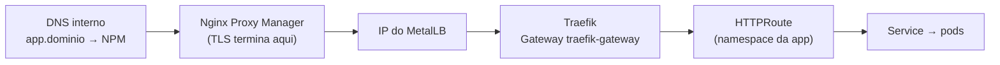
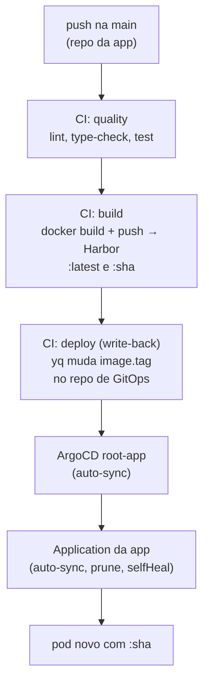

No [post anterior]() o cluster ficou de pé: 3 nós, VIP, MetalLB, tudo como código. Mas um cluster vazio é só uma conta de luz. A pergunta deste post é **como uma aplicação minha chega lá dentro** sem eu rodar `kubectl apply` do laptop, e como ela se atualiza quando eu faço merge na `main`. A resposta tem cinco peças: um ingress, o ArgoCD, Helm, um registry e um jeito de levar segredo pro cluster sem ele encostar no Git.

<!--more-->

A ordem aqui é a ordem em que eu montei, porque cada peça assume a anterior. Primeiro o tráfego entra, depois o deploy vira declarativo, depois a imagem tem de onde vir, por fim os segredos.

## Peça 1: ingress com Gateway API e Traefik (não `Ingress`)

Eu ia instalar o `ingress-nginx` por reflexo, que foi o que sempre usei na cloud. Fui conferir a versão e descobri que o projeto **foi aposentado em março de 2026** (repo arquivado, sem patch de segurança), e o sucessor anunciado não vingou. O caminho oficial do Kubernetes hoje é a **Gateway API**, GA desde 2023, e o controller que eu escolhi foi o **Traefik v3**: leve, nativo no ecossistema k3s, e com suporte completo à Gateway API.

O k3s traz um Traefik embutido, mas eu desliguei (`--disable traefik` no Ansible do post anterior) de propósito: queria a versão que eu escolhesse, instalada por Helm, com valores versionados.

```bash
kubectl apply --server-side -f \
  https://github.com/kubernetes-sigs/gateway-api/releases/download/v1.5.1/standard-install.yaml

helm install traefik traefik/traefik -n traefik --create-namespace \
  --version 40.3.0 \
  --set providers.kubernetesGateway.enabled=true
```

O modelo mental da Gateway API é o que o `Ingress` misturava: o **`Gateway`** é o listener (infra, pertence a quem opera o cluster), e o **`HTTPRoute`** é a regra por hostname (aplicação, vive no namespace dela). O chart já cria o `Gateway` `traefik-gateway` com um listener `web`, e o Service dele é `LoadBalancer`: o MetalLB entrega **um** IP do pool, e esse IP é a porta de entrada de **todas** as aplicações. Uma app nova não gasta IP, só adiciona um `HTTPRoute` com seu hostname.

Gotcha que custou meia hora: o `Gateway` padrão só aceita rotas do **próprio namespace** (`allowedRoutes.namespaces.from: Same`). Pra cada app ter seu `HTTPRoute` no seu namespace, isso vira `All`. E tem que ser pelos **values do chart**, não por `kubectl patch` no objeto: um `helm upgrade` futuro reverteria o patch e você só descobriria quando uma app sumisse.

```yaml
gateway:
  listeners:
    web:
      namespacePolicy:
        from: All
```

O TLS **não** está no cluster. Termina no Nginx Proxy Manager, que já existia na `vlan-core` com o certificado curinga do domínio interno, e de lá o tráfego vai em HTTP até o IP do Traefik. Sem cert-manager, sem mais um lugar pra renovar certificado. O padrão pra expor qualquer app ficou assim:



O NPM preserva o header `Host`, o Traefik casa com o `HTTPRoute` certo. Mais uma regra no pfSense (a VLAN do NPM alcançando o IP do Traefik) e pronto.

## Peça 2: ArgoCD e o padrão app-of-apps

O ArgoCD também entra por Helm, em **modo inseguro** (HTTP) porque o TLS é do NPM: `configs.params."server.insecure"=true`. A senha inicial do admin fica num Secret gerado na instalação; troquei na UI e **apaguei o Secret** em seguida, não tem motivo pra ele continuar existindo.

A estrutura do repositório de estado desejado é a mais simples que funciona, **app-of-apps**:

```
homelab-gitops/
├── bootstrap/root-app.yaml   # a Application "raiz", que cria todas as outras
└── apps/
    ├── traefik.yaml          # Application Helm (chart upstream + values)
    ├── nfs-subdir.yaml       # idem
    └── <minha-app>.yaml      # Application apontando pro chart no repo da app
```

A `root` olha a pasta `apps/` com sync automático (`prune` e `selfHeal` ligados). Adicionar uma aplicação é commitar um arquivo em `apps/`. O único toque manual, uma vez na vida do cluster, é `kubectl apply -f bootstrap/root-app.yaml`.

Um detalhe que achei importante: Traefik e o provisionador de storage **já estavam rodando**, instalados por Helm na mão. Em vez de reinstalar, eu os **adotei**: a Application usa o mesmo chart, mesma versão e mesmos values do release vivo, mas com **sync manual**. Aí eu abro a UI, olho o diff (que precisa ser mínimo), e sincronizo. Se o Helm reclamar de dono do release, dá pra apagar o Secret do release antigo sem apagar os recursos:

```bash
kubectl -n <ns> delete secret -l owner=helm,name=<release>
```

E a decisão de desenho que define onde cada coisa vive, **hub-and-spoke**: o **chart** mora no repositório da aplicação (`deploy/chart`, do lado do código, versionado junto), e a **Application** mora no repositório de GitOps, apontando pra esse path. O repositório de GitOps não sabe como a app funciona, só sabe que ela existe, em qual revisão e com qual tag de imagem.

## Peça 3: Harbor como registry (fora do cluster)

A imagem precisa vir de algum lugar privado. Escolhi o **Harbor**, e a decisão de onde instalá-lo foi "no mesmo host Docker do GitLab" (`encaged`, na `vlan-exposed`): menos uma VM, menos DNS, menos regra de firewall, e os dois já se falam. VM dedicada só pra registry foi descartada por enquanto.

Os blobs vão pra um **dataset NFS no TrueNAS** com quota, e desde o primeiro dia tem **política de retenção** (últimas 5 tags por repo) e **garbage collection semanal**. Registry sem GC é disco que só cresce. O acesso é só interno: o DNS resolve o hostname pro NPM, que termina TLS e repassa pra porta HTTP do Harbor. Push por fora do túnel não existe, e não faz falta.

Um gotcha de proxy que vale cada linha: o `docker push` de uma camada grande voltava **413**, e numa imagem de 15 GB (a do ComfyUI do post anterior) o push simplesmente travava. O NPM precisa, na aba Advanced do proxy host, de:

```nginx
client_max_body_size 0;
proxy_request_buffering off;
proxy_buffering off;
proxy_read_timeout 900s;
proxy_send_timeout 900s;
```

Sem isso o Nginx tenta bufferizar a camada inteira antes de repassar. Com isso, o push de 7 GB de uma camada passou limpo.

O cluster puxa do Harbor com uma **robot account** só de pull, por projeto. Como essa credencial chega no cluster é a peça 5.

## Peça 4: o pipeline que fecha o loop

Agora dá pra desenhar o caminho inteiro de um `git push` até o pod novo:



Os runners do GitLab rodam no `encaged`, em **dois sabores**: um `general` sem acesso ao socket do Docker (roda lint, teste, hadolint) e um `docker-build` com o socket do host, só pra jobs de build. Segurança por tag: um job de teste não ganha o Docker do host por acidente.

O job de `deploy` é o pulo do gato, e é pequeno:

```yaml
deploy:
  stage: deploy
  needs: ["build"]
  rules:
    - if: $CI_COMMIT_BRANCH == $CI_DEFAULT_BRANCH
  script:
    - git clone "https://oauth2:${GITOPS_TOKEN}@<gitlab>/<grupo>/homelab-gitops.git" gitops
    - cd gitops
    - export TAG="$CI_COMMIT_SHORT_SHA"
    - yq -i '(.spec.source.helm.parameters[] | select(.name == "image.tag") | .value) = strenv(TAG)' apps/<minha-app>.yaml
    - git commit -am "deploy(<minha-app>): ${TAG}" && git push origin HEAD:main
```

Ele **não faz deploy**. Ele muda uma linha num outro repositório. Quem faz deploy é o ArgoCD, que viu o commit e reconciliou. Dois efeitos dessa separação que eu gosto: **não tem loop** (o push é em outro repo, então não dispara este pipeline de novo), e o repositório de GitOps vira um **histórico auditável** de tudo que já foi pra produção, com um commit por deploy.

A imagem recebe duas tags: `:latest` fica no Harbor como cache de camadas pro próximo build, e `:sha` é a que de fato vai pro cluster. O ArgoCD **nunca** aponta pra `latest`.

## Peça 5: Infisical operator, ou o segredo que nunca encosta no Git

Faltava o problema de sempre: o pull secret do Harbor, e qualquer segredo de negócio das apps. A opção preguiçosa é `kubectl create secret` na mão, fora do Git, e rezar pra lembrar na reconstrução. A opção certa é o **operator do Infisical** (o vault self-hosted que eu já uso nos hosts Docker): o manifesto no Git só carrega **referências**, o operator busca o valor no vault e materializa um Secret nativo do Kubernetes.

A decisão de arquitetura que organizou tudo: o **bootstrap do operator não é GitOps, é Ansible**. Faz parte do "dia zero" do cluster, junto com o k3s e os pré-requisitos de nó. O motivo é o **secret-zero**: as credenciais do próprio operator (uma Machine Identity com Universal Auth) têm que vir de fora do Git, e o lugar certo pra isso é o mesmo playbook que já roda embrulhado no `infisical run`:

```bash
cd ansible
infisical run --env=prod --path=/k3s/infisical-operator -- \
  ansible-playbook infisical-operator.yml
```

O playbook instala o chart `secrets-operator`, semeia o Secret de bootstrap a partir das variáveis injetadas (com `no_log`, nunca em disco) e aplica dois CRs que são seguros no Git porque não têm valor nenhum:

```yaml
apiVersion: secrets.infisical.com/v1beta1
kind: InfisicalConnection
metadata: { name: infisical, namespace: infisical-operator }
spec:
  address: https://vault.<dominio-interno>     # base URL, SEM /api
---
apiVersion: secrets.infisical.com/v1beta1
kind: InfisicalAuth
metadata: { name: machine-identity, namespace: infisical-operator }
spec:
  method: universal
  infisicalConnectionRef: { name: infisical, namespace: infisical-operator }
  universal:
    clientIdRef:     { name: infisical-universal-auth, namespace: infisical-operator, key: clientId }
    clientSecretRef: { name: infisical-universal-auth, namespace: infisical-operator, key: clientSecret }
```

Daí pra frente, **cada app declara seus próprios segredos no próprio chart**. O pull secret do Harbor, por exemplo, é um `InfisicalStaticSecret` dentro do chart da aplicação:

```yaml
apiVersion: secrets.infisical.com/v1beta1
kind: InfisicalStaticSecret
metadata:
  name: harbor-pull
spec:
  infisicalAuthRef: { name: machine-identity, namespace: infisical-operator }
  sources:
    - projectId: "<id-do-projeto>"
      environmentSlug: prod
      secretPath: /k3s/harbor
  syncOptions:
    refreshInterval: 60s
  targets:
    - kind: Secret
      name: harbor-pull
      namespace: {{ .Release.Namespace }}
      creationPolicy: Orphan
      secretType: kubernetes.io/dockerconfigjson
      template:
        engineVersion: v1
        data:
          .dockerconfigjson: |
{{ .Values.registryPullSecret.dockerConfigJsonTemplate | indent 12 }}
```

Ansible entrega a **capacidade** de ter segredos; o chart declara o **uso**. Zero valores em qualquer repositório. E quando o ArgoCD sincroniza o chart, ele adota o Secret que já existia (`creationPolicy: Orphan`), sem janela sem credencial.

Os gotchas do operator, todos achados na marra porque a documentação estava atrás do schema real:

- **`address` é a base URL sem `/api`.** O operator anexa `/api/v4` sozinho; com `/api` no fim vira `/api/api/v4` e 404.
- **403 mesmo autenticando** = a Machine Identity existe na organização mas **não foi adicionada ao projeto** com role de leitura. Criar a identity não basta.
- **Helm e o template do operator usam a mesma sintaxe `{{ }}`.** O template que monta o `dockerconfigjson` é Go-template **do operator**, não do Helm. O truque é guardá-lo como **dado** nos `values.yaml` e injetar com `| indent`: o Helm passa as chaves adiante sem processar.
- **O certificado do vault precisa validar de dentro da VLAN do cluster.** No meu caso o NPM entrega um cert válido, então sem `caCertificate` customizado; mas a regra de firewall VLAN do cluster → NPM precisa existir.

## Os gotchas do ArgoCD, em forma de checklist

- **`HTTPRoute` eternamente `OutOfSync`** → o API server preenche `group`, `kind` e `weight` nos `parentRefs` e `backendRefs`; se o chart omite, o Argo vê drift pra sempre. Escreva os três explicitamente.
- **"repository not permitted"** → o repo foi registrado no Argo em um `Project` diferente do `project:` da Application. Alinhe os dois.
- **`ComparisonError: app path does not exist`** → o chart só existe numa branch de feature. O Argo lê a revisão que a Application aponta (`main`), então o chart precisa estar mergeado antes.
- **Pod novo com `ImagePullBackOff` logo depois de uma mudança no pull secret** → ordem de merge. Chart com o `InfisicalStaticSecret` entra na `main` **antes** do repo de GitOps parar de referenciar o Secret manual, senão há uma janela sem credencial.
- **Conflito no write-back** → se você editar `apps/<app>.yaml` na mão numa branch velha, o CI já mudou `image.tag` na `main`. Reaplique sua mudança em cima do estado atual, nunca force por cima do `image.tag`.
- **Senha do admin "não funciona"** → você apagou o Secret inicial (bem feito) e esqueceu que já tinha trocado na UI.

## O que vem na série

Loop fechado, validado de ponta a ponta: merge na `main` do repo da app, CI builda e publica no Harbor, write-back no repo de GitOps, ArgoCD reconcilia, pod novo com a tag do commit, saúde `ok` via Traefik e via NPM com TLS válido. As aplicações que estou desenvolvendo nessa infra entram no cluster por esse caminho, e só por ele.

Ficou uma coisa de fora de propósito: onde o dado dessas aplicações **mora**, e como eu enxergo o que está acontecendo no homelab inteiro quando algo quebra. O [próximo post]() fecha o arco com storage dinâmico em NFS no TrueNAS e a stack de observabilidade (Loki, Prometheus, Grafana) com alertas que chegam no celular.
