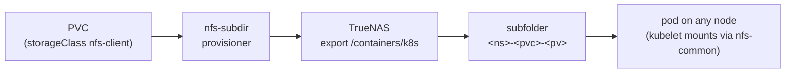
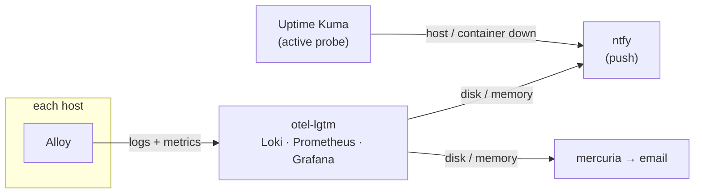

The two previous posts brought up the [cluster]() and closed the [deploy loop](). Two questions remain, the ones every system answers badly at first: **where the data lives** when a pod dies and is reborn on another node, and **how I find out something broke** before finding out through the symptom. The first half is dynamic NFS storage on TrueNAS. The second is the observability stack for the whole homelab, with the alerts that actually reach my phone.

<!--more-->

## Part 1: dynamic NFS storage

### The problem `local-path` does not solve

k3s ships with a built-in provisioner, `local-path`: each volume is a folder on the disk of the node where the pod was scheduled. It is fast and needs nothing. And it is a trap for anything stateful: if the pod moves to another node (because the node died, because you drained it for an upgrade, because the scheduler felt like it), **the data stays behind**. In a 3-node cluster built precisely to practice drain and upgrades, that is unacceptable for application data.

The alternative I already had ready was **TrueNAS** (`sokolov`, from the [first post]()), which already serves NFS to the Docker hosts. What was missing was the cluster **requesting volumes on its own**, without me creating an export and a `PersistentVolume` by hand for every app.

### nfs-subdir-external-provisioner

The `nfs-subdir-external-provisioner` does exactly that: it points at **one** NFS export, and for each `PersistentVolumeClaim` it creates a **subfolder** and a `PersistentVolume` pointing at it. Dynamic, with a `StorageClass` that becomes the cluster default:

```bash
helm install nfs-subdir nfs-subdir-external-provisioner/nfs-subdir-external-provisioner \
  -n nfs-provisioner --create-namespace \
  --set nfs.server=<nas-ip> \
  --set nfs.path=/mnt/<pool>/containers/k8s \
  --set storageClass.name=nfs-client \
  --set storageClass.defaultClass=true
```

From there, an application PVC is just this, and it goes `Bound` in seconds:

```yaml
apiVersion: v1
kind: PersistentVolumeClaim
metadata:
  name: app-data
  annotations:
    helm.sh/resource-policy: keep    # removing the release does not delete the data
spec:
  accessModes: [ReadWriteMany]       # NFS allows RWX; local-path would be RWO
  storageClassName: nfs-client
  resources:
    requests:
      storage: 1Gi
```



On the TrueNAS side, three decisions: the dataset has a **quota** (same principle as Harbor: container space grows without limit if you let it); the export only accepts the `vlan-lab` subnet; and the user mapping is **Maproot = root**, not Mapall, because the provisioner runs as root and needs to create the subfolders. Using both together breaks permissions in a way that is hard to debug.

### Two gotchas that only show up later

**Two defaults.** `--set storageClass.defaultClass=true` left `nfs-client` **and** `local-path` both marked as default. A PVC without `storageClassName` becomes ambiguous and the behavior depends on the controller's mood. The fix is to strip the annotation from `local-path`:

```bash
kubectl patch storageclass local-path \
  -p '{"metadata":{"annotations":{"storageclass.kubernetes.io/is-default-class":"false"}}}'
```

`local-path` keeps existing for explicit use (cache, scratch), where losing the data on migration does not matter.

**Deleting a PVC does not delete the data.** The provisioner ships with `archiveOnDelete: true`: the `ReclaimPolicy` is `Delete`, the PV goes away, but the subfolder on NFS is **renamed** to `archived-*` instead of deleted. It is a safety net against `kubectl delete` in the wrong namespace, and I kept it. The cost is cleaning up `archived-*` folders on TrueNAS now and then.

### What the node needs (and what it does not)

The one mounting NFS **is not** the provisioner, it is each node's **kubelet**, per pod, at the moment the pod is scheduled there, and it unmounts when the pod ends. That means two things: every node needs the `nfs-common` package (`mount.nfs` is the only requirement, which is why it is in the first post's prerequisites playbook), and **there is no `fstab`**. Kubernetes manages the mount lifecycle; on a node reboot, it remounts on its own when the pod comes back. People coming from traditional Docker hosts try to mount the NFS on the node and mix up the two layers.

### The cross-VLAN plumbing (the same pain, twice)

The cluster is on `vlan-lab` and TrueNAS on `vlan-core`. For a pod to mount NFS, **two** things must exist, and one alone is not enough:

1. **A pfSense rule** allowing `vlan-lab` to the NAS's port 2049, **above** the inter-VLAN block rules.
2. **A static return route on TrueNAS** for the `vlan-lab` subnet via the `vlan-core` gateway.

Without the second, the `SYN` leaves the pod, reaches the NAS, and the `SYN-ACK` does not know how to come back: silent timeout, with no useful log anywhere. I had been through exactly this when Harbor (on another VLAN) needed the same NFS, and I still took a while to remember. Written down for the third time.

## Part 2: observability for the whole homelab

Here I widen the scope. The observability stack is not the cluster's, it is the **whole homelab's**: it was born before k3s, lives on a Docker host, and that is where everything sends logs and metrics. The cluster is one more emitter joining the list.

### The stack: otel-lgtm and one Alloy per host

Instead of assembling Loki, Prometheus, Tempo and Grafana piece by piece, I use the **`grafana/otel-lgtm`** image, which packs everything into a single container, on `willy`. For a homelab, the simplicity of one container outweighs the lack of horizontal scale, which I do not need.

Collection is done by **Grafana Alloy**, with **one per host**: `willy`, `mobydick`, `encaged` and Proxmox itself. Each has its own config, versioned in the homelab repo, and all send to the same destination:

| Host | What Alloy collects |
|------|---------------------|
| `willy` | node metrics, logs from every container (via the Docker socket), **syslog** from the Proxmox VMs and LXCs, the Proxmox exporter |
| `mobydick`, `encaged` | node metrics, container logs |
| Proxmox (host) | systemd journal, task logs, firewall, auth, and the logs of my own scripts (the GPU hookscript and the VM scheduler) |

The part I like most is the last row. The hookscript that orchestrates the GPU between VMs (from the [VFIO post]()) emits structured events (phase, target VM, the VM it took down), which reach Loki through the Proxmox journal, and Alloy has a parse stage that turns the parts that matter into labels:

```hcl
stage.match {
  selector = `{job="gpu-guard"}`
  stage.regex {
    expression = `(?P<timestamp>\S+ \S+) (?P<event_type>\w+) phase=(?P<phase>[\w-]+) vmid=(?P<vmid>\d+)(?P<extra>.*)`
  }
  stage.labels { values = { event_type = "", phase = "", vmid = "" } }
}
```

Result: in Grafana I can ask "how many times did the hookscript take down a VM to hand the GPU to another one this week" with a label query. Defensive automation that also explains itself.

### The 10 GB gotcha: retention that does not retain

One day `willy`'s disk flagged growth, and `du` pointed at Loki with **10 GB** (against 549 MB for Prometheus). The `otel-lgtm` image ships a Loki config **with no compactor and no `limits_config`**, which in practice means **infinite retention**. And here is the catch: just adding `retention_period` does not fix it. With the v13 schema, retention requires the **compactor with `retention_enabled`** and a **`delete_request_store`**. Without both, the number sits there looking nice in the YAML and nothing expires.

```yaml
compactor:
  working_directory: /data/loki/compactor
  compaction_interval: 10m
  retention_enabled: true
  retention_delete_delay: 2h
  delete_request_store: filesystem

limits_config:
  retention_period: 720h    # 30 days
```

That file is mounted over the image's original. Prometheus landed at 90 days and Pyroscope at 30, both via command-line flags through the image's environment variables:

```yaml
environment:
  PROMETHEUS_EXTRA_ARGS: "--storage.tsdb.retention.time=90d"
  PYROSCOPE_EXTRA_ARGS: "-compactor.blocks-retention-period=720h"
```

### Alerts as code, and where they go

An alert configured in Grafana's UI is an alert that vanishes on rebuild. So alerting is **provisioned from a file**, mounted at `conf/provisioning/alerting/` inside the container. Three parts:

**Contact point** `homelab`, with two receivers that fire together:

```yaml
contactPoints:
  - name: homelab
    receivers:
      - type: webhook                       # push to the phone
        settings:
          url: http://ntfy/<topic>           # by container name on the internal network, not through the proxy
      - type: email                         # via mercuria, the SMTP relay from the first post
        settings:
          addresses: $__env{ALERT_EMAIL_TO}
```

**ntfy** is a self-hosted push notification server, running on the same host. The `http://ntfy/...` detail is deliberate: Grafana talks to it **by container name on Docker's internal network**, without going through the reverse proxy or DNS. If the proxy or DNS go down (which is exactly when I want to be alerted), the alert still arrives. And ntfy is not exposed to the outside: it is an internal channel, the phone gets email.

Email goes through `mercuria`, the Postfix relay from the first post. A detail Grafana OSS does not make obvious: **SMTP is not configurable from the UI**, only through environment variables (`GF_SMTP_*`). Contact points and rules are.

**Routing policy**, grouping by alert and host, so one host filling three partitions does not turn into three notifications:

```yaml
policies:
  - receiver: homelab
    group_by: ["alertname", "instance"]
    group_wait: 30s
    group_interval: 5m
    repeat_interval: 4h
```

**Rules**, resource-only, generic per host (no hardcoded hostname in the YAML):

| Rule | Condition | Severity |
|------|-----------|----------|
| Disk high | > 85% on any real filesystem, for 10 min | warning |
| Disk critical | > 95%, for 5 min | critical |
| Memory high | > 90%, for 10 min | warning |

### The decision: what Grafana does NOT alert on

Missing are "host down" and "container down", the most obvious alerts of all. And they **are not in Grafana on purpose**. The reason is structural: Alloy **pushes** metrics to Prometheus (`remote_write`). There is no scrape, hence no `up` series, and no per-container metrics either. Grafana would only know a host vanished through the **absence** of data, which is the most fragile kind of alert there is.

That job belongs to **Uptime Kuma**, which was already running on the same host: an active prober, with a native Docker monitor (via the daemon API), parent and child monitors (Plex depends on the media VM), and its own notifications to ntfy. Grafana watches **resources**; Kuma watches **availability**. The right tool for each question.



### The lesson that came later: noise trains a blind spot

A confession to close. One of the VMs shuts down every day in a fixed early-morning window (on purpose, for backups). Kuma warned **every day** that it went down and came back. After two weeks, I was not even reading the notification anymore. When that VM's GPU stopped loading its driver because of a kernel update, the alert was **exactly the same** as the daily one, and it took me 13 days to notice the whole AI stack was down.

The fix was not technical, it was design: a maintenance window on the monitor (silence during that hour), and **resend** turned on, so an alert that persists keeps shouting instead of warning once and going quiet. An alert you learn to ignore is worse than no alert, because it teaches you not to look. That incident deserves its own post, further down the line.

## What comes next in the series

This closed the **cluster** arc: it comes up as code, applications enter through GitOps, data lives on TrueNAS and survives pod migration, and the whole homelab reports to the same place. What is still pending, and I write it down to hold myself to it: the cluster does not yet send its own logs and metrics to LGTM (today only the Docker hosts and Proxmox do), and the disk alerts do not yet see the NAS dataset where the volumes live.

The next arc is about **operating** all of this: the incidents that happened after the infra was ready, what each one taught, and what became automation so it does not happen again.
