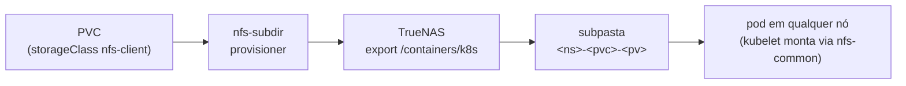
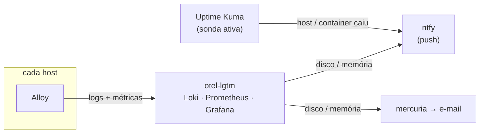

Os dois posts anteriores subiram o [cluster]() e fecharam o [loop de deploy](). Faltam as duas perguntas que todo sistema responde mal no começo: **onde o dado mora** quando o pod morre e nasce em outro nó, e **como eu descubro que algo quebrou** antes de descobrir pelo sintoma. A primeira metade é storage dinâmico em NFS no TrueNAS. A segunda é a stack de observabilidade do homelab inteiro, com os alertas que de fato chegam no meu celular.

<!--more-->

## Parte 1: storage dinâmico em NFS

### O problema que o `local-path` não resolve

O k3s vem com um provisionador embutido, o `local-path`: cada volume é uma pasta no disco do nó onde o pod foi agendado. É rápido e não precisa de nada. E é uma armadilha pra qualquer coisa com estado: se o pod migra pra outro nó (porque o nó caiu, porque fez drain pra upgrade, porque o scheduler quis), **o dado fica pra trás**. Num cluster de 3 nós feito pra praticar exatamente drain e upgrade, isso é inaceitável pra dado de aplicação.

A alternativa que eu já tinha pronta é o **TrueNAS** (`sokolov`, do [primeiro post]()), que já serve NFS pros hosts Docker. O que faltava era o cluster **pedir volume sozinho**, sem eu criar export e `PersistentVolume` à mão a cada app.

### nfs-subdir-external-provisioner

O `nfs-subdir-external-provisioner` faz exatamente isso: aponta pra **um** export NFS, e pra cada `PersistentVolumeClaim` ele cria uma **subpasta** e um `PersistentVolume` apontando pra ela. Dinâmico, e com uma `StorageClass` que vira o default do cluster:

```bash
helm install nfs-subdir nfs-subdir-external-provisioner/nfs-subdir-external-provisioner \
  -n nfs-provisioner --create-namespace \
  --set nfs.server=<ip-do-nas> \
  --set nfs.path=/mnt/<pool>/containers/k8s \
  --set storageClass.name=nfs-client \
  --set storageClass.defaultClass=true
```

A partir daí, um PVC de aplicação é só isso, e ele fica `Bound` em segundos:

```yaml
apiVersion: v1
kind: PersistentVolumeClaim
metadata:
  name: app-data
  annotations:
    helm.sh/resource-policy: keep    # remover o release não apaga o dado
spec:
  accessModes: [ReadWriteMany]       # NFS permite RWX; local-path seria RWO
  storageClassName: nfs-client
  resources:
    requests:
      storage: 1Gi
```



Do lado do TrueNAS, três decisões: o dataset tem **quota** (o mesmo princípio do Harbor: espaço de container cresce sem limite se você deixar); o export só aceita a sub-rede da `vlan-lab`; e o mapeamento de usuário é **Maproot = root**, não Mapall, porque o provisionador roda como root e precisa criar as subpastas. Usar os dois juntos quebra a permissão de um jeito difícil de depurar.

### Dois gotchas que só aparecem depois

**Dois defaults.** O `--set storageClass.defaultClass=true` deixou a `nfs-client` **e** a `local-path` ambas marcadas como default. Um PVC sem `storageClassName` vira ambíguo e o comportamento depende do humor do controller. O fix é tirar a anotação da `local-path`:

```bash
kubectl patch storageclass local-path \
  -p '{"metadata":{"annotations":{"storageclass.kubernetes.io/is-default-class":"false"}}}'
```

A `local-path` continua existindo pra uso explícito (cache, scratch), onde perder o dado na migração não importa.

**Apagar um PVC não apaga o dado.** O provisionador vem com `archiveOnDelete: true`: a `ReclaimPolicy` é `Delete`, o PV some, mas a subpasta no NFS é **renomeada** pra `archived-*` em vez de apagada. É uma rede de segurança contra `kubectl delete` no namespace errado, e eu mantive. O custo é limpar as pastas `archived-*` no TrueNAS de vez em quando.

### O que o nó precisa (e o que ele não precisa)

Quem monta o NFS **não é** o provisionador, é o **kubelet** de cada nó, por pod, na hora em que o pod é agendado ali, e desmonta quando o pod termina. Isso significa duas coisas: todos os nós precisam do pacote `nfs-common` (o `mount.nfs` é o único requisito, e por isso ele está no playbook de pré-requisitos do primeiro post), e **não existe `fstab`**. O Kubernetes gerencia o ciclo de montagem; no reboot do nó, ele remonta sozinho quando o pod volta. Quem vem de host Docker tradicional tenta montar o NFS no nó e confunde as duas camadas.

### O encanamento entre VLANs (a mesma dor duas vezes)

O cluster está na `vlan-lab` e o TrueNAS na `vlan-core`. Pra um pod montar NFS, **duas** coisas precisam existir, e uma só não basta:

1. **Regra no pfSense** liberando a `vlan-lab` pra porta 2049 do NAS, **acima** das regras de bloqueio entre VLANs.
2. **Rota estática de volta no TrueNAS** pra sub-rede da `vlan-lab` via o gateway da `vlan-core`.

Sem a segunda, o `SYN` sai do pod, chega no NAS, e o `SYN-ACK` não sabe voltar: timeout silencioso, sem nenhum log útil em lugar nenhum. Eu já tinha passado por exatamente isso quando o Harbor (em outra VLAN) precisou do mesmo NFS, e mesmo assim demorei a lembrar. Fica registrado pra terceira vez.

## Parte 2: observabilidade do homelab inteiro

Aqui eu subo de escopo. A stack de observabilidade não é do cluster, é do **homelab inteiro**: ela nasceu antes do k3s, mora num host Docker, e é pra lá que tudo manda log e métrica. O cluster é mais um emissor que entra na lista.

### A stack: otel-lgtm e um Alloy por host

Em vez de montar Loki, Prometheus, Tempo e Grafana peça por peça, eu uso a imagem **`grafana/otel-lgtm`**, que empacota tudo num container só, no `willy`. Pra um homelab, a simplicidade de um container compensa a falta de escala horizontal, que eu não preciso.

A coleta é feita pelo **Grafana Alloy**, com **um por host**: `willy`, `mobydick`, `encaged` e o próprio Proxmox. Cada um tem sua config, versionada no repo do homelab, e todas mandam pro mesmo destino:

| Host | O que o Alloy coleta |
|------|----------------------|
| `willy` | métricas do nó, logs de todos os containers (via socket do Docker), **syslog** das VMs e LXCs do Proxmox, exporter do Proxmox |
| `mobydick`, `encaged` | métricas do nó, logs dos containers |
| Proxmox (host) | journal do systemd, logs de tarefas, firewall, auth, e os logs dos meus scripts (o hookscript da GPU e o agendador de VMs) |

A parte que eu mais gosto é a última linha. O hookscript que orquestra a GPU entre VMs (do [post do VFIO]()) emite eventos estruturados (fase, VM alvo, VM derrubada), que chegam no Loki pelo journal do Proxmox, e o Alloy tem um estágio de parse pra virar label o que importa:

```hcl
stage.match {
  selector = `{job="gpu-guard"}`
  stage.regex {
    expression = `(?P<timestamp>\S+ \S+) (?P<event_type>\w+) phase=(?P<phase>[\w-]+) vmid=(?P<vmid>\d+)(?P<extra>.*)`
  }
  stage.labels { values = { event_type = "", phase = "", vmid = "" } }
}
```

Resultado: no Grafana eu consigo perguntar "quantas vezes o hookscript derrubou uma VM pra entregar a GPU pra outra esta semana" com uma query de label. Automação defensiva que também se explica.

### O gotcha dos 10 GB: retenção que não retém

Um dia o disco do `willy` acusou crescimento, e o `du` apontou o Loki com **10 GB** (contra 549 MB do Prometheus). A imagem `otel-lgtm` vem com uma config do Loki **sem compactor e sem `limits_config`**, o que na prática significa **retenção infinita**. E aqui mora a pegadinha: colocar só `retention_period` não resolve. Com o schema v13, retenção exige o **compactor com `retention_enabled`** e um **`delete_request_store`**. Sem os dois, o número fica lá bonito no YAML e nada expira.

```yaml
compactor:
  working_directory: /data/loki/compactor
  compaction_interval: 10m
  retention_enabled: true
  retention_delete_delay: 2h
  delete_request_store: filesystem

limits_config:
  retention_period: 720h    # 30 dias
```

Esse arquivo é montado por cima do original da imagem. Prometheus ficou em 90 dias e o Pyroscope em 30, os dois por flag de linha de comando via variável de ambiente da imagem:

```yaml
environment:
  PROMETHEUS_EXTRA_ARGS: "--storage.tsdb.retention.time=90d"
  PYROSCOPE_EXTRA_ARGS: "-compactor.blocks-retention-period=720h"
```

### Alertas como código, e pra onde eles vão

Alerta configurado na UI do Grafana é alerta que some na reconstrução. Então o alerting é **provisionado por arquivo**, montado em `conf/provisioning/alerting/` dentro do container. Três partes:

**Contact point** `homelab`, com dois receptores que disparam juntos:

```yaml
contactPoints:
  - name: homelab
    receivers:
      - type: webhook                       # push no celular
        settings:
          url: http://ntfy/<topico>          # pelo nome do container na rede interna, não pelo proxy
      - type: email                         # via mercuria, o relay SMTP do primeiro post
        settings:
          addresses: $__env{ALERT_EMAIL_TO}
```

O **ntfy** é um servidor de push notification self-hosted, que roda no mesmo host. O detalhe do `http://ntfy/...` é deliberado: o Grafana fala com ele **pelo nome de container na rede interna do Docker**, sem passar pelo proxy reverso nem pelo DNS. Se o proxy ou o DNS caírem (que é exatamente quando eu quero ser alertado), o alerta ainda chega. E o ntfy não é exposto pra fora: é canal interno, o celular recebe por e-mail.

O e-mail passa pelo `mercuria`, o relay Postfix do primeiro post. Detalhe que o Grafana OSS não deixa óbvio: **SMTP não é configurável pela UI**, só por variável de ambiente (`GF_SMTP_*`). Contact points e regras, sim.

**Política de roteamento**, agrupando por alerta e host, pra um host enchendo três partições não virar três notificações:

```yaml
policies:
  - receiver: homelab
    group_by: ["alertname", "instance"]
    group_wait: 30s
    group_interval: 5m
    repeat_interval: 4h
```

**Regras**, só de recurso, genéricas por host (nenhum hostname fixo no YAML):

| Regra | Condição | Severidade |
|-------|----------|------------|
| Disco alto | > 85% em qualquer filesystem real, por 10 min | warning |
| Disco crítico | > 95%, por 5 min | critical |
| Memória alta | > 90%, por 10 min | warning |

### A decisão: o que o Grafana NÃO alerta

Faltam "host caiu" e "container caiu", que são os alertas mais óbvios. E eles **não estão no Grafana de propósito**. O motivo é estrutural: o Alloy **empurra** métricas pro Prometheus (`remote_write`). Não existe scrape, logo não existe a série `up`, e também não há métrica por container. O Grafana só saberia que um host sumiu pela **ausência** de dados, que é o tipo de alerta mais frágil que existe.

Esse trabalho é do **Uptime Kuma**, que já rodava no mesmo host: um sondador ativo, com monitor nativo de Docker (via API do daemon), monitores pai e filho (o Plex depende da VM de mídia), e notificação própria pro ntfy. Grafana olha **recurso**; Kuma olha **disponibilidade**. Ferramenta certa pra cada pergunta.



### A lição que veio depois: ruído treina ponto cego

Uma confissão pra fechar. Uma das VMs desliga todo dia numa janela fixa de madrugada (é de propósito, pra backup). O Kuma avisava **todo dia** que ela caiu e voltou. Depois de duas semanas, eu já nem lia a notificação. Quando a GPU dessa VM parou de carregar o driver por causa de um update de kernel, o alerta era **exatamente igual** ao diário, e eu levei 13 dias pra perceber que o stack de IA inteiro estava fora.

A correção não foi técnica, foi de desenho: janela de manutenção no monitor (silêncio naquele horário), e **resend** ligado, pra um alerta que persiste continuar gritando em vez de avisar uma vez e calar. Alerta que você aprende a ignorar é pior que alerta nenhum, porque ele te ensina a não olhar. Esse incidente merece post próprio, mais pra frente.

## O que vem na série

Esse fechou o arco do **cluster**: ele sobe como código, as aplicações entram por GitOps, o dado mora no TrueNAS e sobrevive à migração de pod, e o homelab inteiro reporta pro mesmo lugar. O que ficou pendente, e eu registro pra me cobrar: o cluster ainda não manda os próprios logs e métricas pro LGTM (hoje só os hosts Docker e o Proxmox fazem isso), e os alertas de disco ainda não enxergam o dataset do NAS onde os volumes vivem.

O próximo arco é sobre **operar** tudo isso: os incidentes que aconteceram depois que a infra ficou pronta, o que cada um ensinou, e o que virou automação pra não acontecer de novo.
