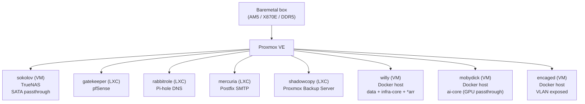
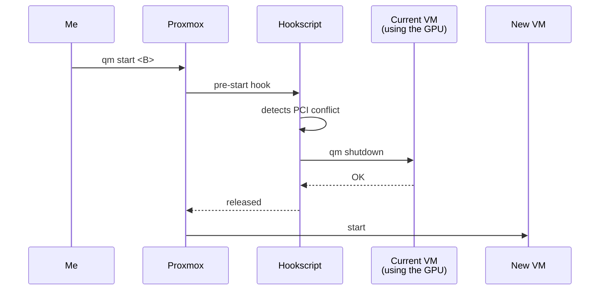

Before anything was running here — Honcho, LiteLLM, GitLab, the *arr stack — it all started with **one physical host** and a handful of decisions that looked small but turned into the pillars of everything that came after. This post is about those decisions, and what I learned by making the wrong ones first.

<!--more-->

## The hardware

I started with something that could stay coherent for 5+ years. A single box:

| Component        | Spec                                                |
| ---------------- | --------------------------------------------------- |
| Platform         | AMD AM5                                             |
| Motherboard      | MSI MPG X870E EDGE TI WIFI                          |
| Chipset          | AMD X870E                                           |
| Memory           | DDR5, 4 slots (up to 256 GB)                        |
| Storage HDD      | 1× Seagate IronWolf 8 TB                            |
| Storage NVMe     | 2× Samsung M.2 NVMe 2 TB + 1× Samsung M.2 EVO 500GB |
| Storage SATA SSD | 1× SATA SSD 1 TB                                    |

Simple decision: one well-sized box instead of 3 mini-PCs. Cheaper per watt, simpler to maintain, and it gives me an upgrade path (up to 256 GB of RAM fit on this board).

From there, everything is virtualized. The host runs Proxmox and nothing else, no Windows on the metal. But I still want to use Windows now and then, so I installed it on a dedicated SSD and pass the whole disk through to a VM. As a bonus, since Windows lives on its own physical disk, I can boot straight into it (real dual boot) if I ever need the bare machine, no Proxmox in the middle.

## Decision 1 — Proxmox instead of plain bare metal

I could run Docker straight on the host. It works. But:

- **Atomic snapshot/backup** of a whole "machine" doesn't exist in plain Docker the way it does with a VM/LXC.
- **Network isolation** turns into iptables gymnastics. In a VM you get a dedicated NIC, full control, done.
- **Hardware passthrough** (GPU, SATA controller, USB) needs a hypervisor to stay clean.
- **Learning** Proxmox/KVM/LXC is interesting in itself, and it adds one more bit of on-prem infra experience.

I chose Proxmox VE. The alternatives I dropped: ESXi (free tier died), Hyper-V (too Windows-centric), raw libvirt (UI matters for visual debugging when you're on your own). I didn't pick Kubernetes/k3s at the hypervisor level because k8s **isn't a hypervisor** — it orchestrates containers. Different decisions, different layers. (k3s comes later, in dedicated VMs — more on that at the end.)

## The Proxmox layer — how I organized it

Instead of one giant VM "that does everything", I split by **function**. Each VM or LXC has a single clear role:

Each little box is disposable and can be rebuilt independently. If `willy` gets corrupted, I restore just that one from PBS without touching the rest. That's the real ROI of virtualization: **a small blast radius**.

> Small easter egg: the names follow a Kojima games theme — Metal Gear Solid and Death Stranding. `shagohod`, `sokolov`, `mobydick` (the alias Kojima used to hide MGSV), `gatekeeper`... it helps me remember and gives each thing an identity. The idea is semantic names that make sense in my head, instead of just naming a resource after whatever service runs on it.

## Decision 2 — TrueNAS as a VM, not an LXC

I tried LXC first. **Mistake.** TrueNAS's ZFS wants to see the physical disks, not a mount point shared with the host. LXC shares the kernel; a VM doesn't. For ZFS to read SMART, manage SAT/I-O directly, and do an honest scrub, it needs to **own the SATA controller**.

The fix was passing the whole SATA controller via PCIe passthrough to the `sokolov` VM. From that moment on, TrueNAS owns the disks — Proxmox doesn't even see them anymore. ZFS happy.

I wish that had been it. Over time I noticed the VM would die and my Zpool would corrupt. That was a nasty headache to track down, the kind that takes days, until I really understood what was happening. In the end it was simple: the whole point of the NAS was for my services to share the disk mount via NFS or SMB. But for some reason VFIO would reset the bus during the VM's lifetime, because SATA passthrough is finicky. Even isolating the VFIO group, the kernel kept resetting it for some reason. I never found a decent VFIO solution, so I basically dropped the SATA controller passthrough and handed the disk to the VM through Proxmox instead — the device sat on the Proxmox host and I passed the whole device into the VM. It's not bare metal, but it meets my need.

**Lesson:** when software manages hardware (storage controller, GPU, USB), it wants to see hardware. Don't try to abstract it away.

Current pools:
- **IronWolf 8 TB** → main pool: media, cloud sync, data.
- **SATA SSD 1 TB** → secondary pool: container cache, hot snapshots.
- **Plan**: a second IronWolf for a RAID1 mirror when the budget allows.

## Decision 3 — Network segmentation (pfSense + VLANs)

The house LAN is the same place where the smart toaster, the console, and your friend's phone live. I genuinely didn't want my services holding IPs on the local network, and since I like studying security and practicing in the homelab, I wanted to isolate an attack vector. I'll admit it was a lot of fun to set up — I have a solid networking background, and putting it into practice helped cement a few concepts.

Solution: `pfSense` as an LXC (`gatekeeper`), with **3 internal VLANs** (I'm using symbolic names here, obviously):

| VLAN           | Purpose                                                                                                          |
| -------------- | --------------------------------------------------------------------------------------------------------------- |
| `vlan-core`    | Internal infra/data/AI (willy, mobydick, sokolov, rabbitrole, mercuria — the little name game from earlier)     |
| `vlan-exposed` | Remotely accessible services (encaged)                                                                          |
| `vlan-lab`     | Isolated environment for labs and a future k3s cluster                                                          |

Access from outside:
- **The local LAN** can't reach the VLANs without going through `pfSense`.
- **From outside the router**, I use **Wireguard** to get into the internal VLANs.
- **Public services** (GitLab, Honcho-API, etc.) go out via **Cloudflare Tunnel** with **Zero Trust** — `cloudflared` running on `willy`, **Nginx Proxy Manager** doing the internal reverse proxy. Nothing exposed directly to the internet.
- **Internal DNS** (`rabbitrole` running Pi-hole) only resolves when you're connected via Wireguard. That's intentional — internal domains don't leak.

This design isn't "elegant", it's **defensive**: if a port opens by mistake, it opens inside a VLAN, not on the whole network.

## Decision 4 — Rotating GPU passthrough (and a hookscript so I don't shoot myself in the foot)

I have a consumer-grade NVIDIA GPU. It has to serve, at different times:

- **mobydick** when I run Ollama / ComfyUI.
- **A Windows VM** when I want a "desktop over the network" to game or run an app that only exists on Windows.
- **A Kali VM** when I'm studying/testing something that needs a GPU.

You can't have GPU passthrough on two VMs at once — there's only one card. The first time I started the Windows VM with `mobydick` still up, Proxmox choked and I locked up the session, and then you have to reset it. Anyway, orchestrating that by hand wasn't an option either.

The fix was a **hookscript** that runs on VM start. It detects whether another VM is holding the GPU's PCI device, and **shuts that one down first** before bringing up the new one. Defensive:

A lesson that became a pattern: **defensive automation > human memory**. The whole reason for writing this blog is... I'll forget all of it at some point. Six months from now I won't remember this detail. The hookscript remembers. And now the blog has it documented too.

## Decision 5 — Multi-layer backup (PBS)

Backup is one of those things that feels boring until the day it saves your life. The structure I landed on:

- **PBS** runs as an LXC (`shadowcopy`).
- **Two datastores**:
  - `pbs-local` — on the ZFS pool `zero` (NVMe 2 TB), dataset `zero/pbs`. Fast for restore.
  - `pbs-nas` — on **NFS exported by TrueNAS**. Slower, but on a different pool — it survives if the NVMe dies.
- **Sync** between the two datastores, scheduled.
- **Retention**: Keep Last + Daily + Weekly + Monthly. Dedup makes the storage fit (now there's something interesting to study...).

**Big gotcha**: I tried to mount the NFS **inside the** PBS container. The LXC's **rootfs filled up** because the NFS cache started pushing into the overlayfs. (Mount points and block devices biting me again... but this one was easy to fix... honestly the bug was my own stubbornness...) The right fix: mount the NFS **on the Proxmox host** and pass it into the LXC via `mp0`. A lesson worth noting — an LXC isn't a mini-VM, it shares layers with the host.

Beyond PBS, scripts running via `cron.daily` on the Proxmox host use `proxmox-backup-client` to:
- Do a **curated daily backup** of critical configs.
- Do a **full weekly backup** of the host rootfs with exclusions (cache, rotating logs).

## Decision 6 — Centralized email (mercuria)

Notifications are everything... but here's something that bugs me: uncoordinated notifications. Every service needed its own SMTP config, a credential, and so on. Every service wants to send an alert email. Proxmox wants to send when a task fails. TrueNAS wants to send when a disk looks suspicious. PBS wants to send when GC runs. pfSense wants to send when a block sneezes.

Instead of configuring SMTP on **each** of these, I set up a single LXC (`mercuria`) running **Postfix** as a relay. Every service points at it, and it does the sending via a SaaS email gateway (pick whichever one you like). And `pfSense` only allows SMTP leaving from `mercuria` — anything else trying 587/465 hits the wall.

For inbound email, **Cloudflare Email Routing** with SPF/DKIM/DMARC configured. (That was architectural fluff, but I did it because I wanted to understand a few concepts.)

**A pattern I keep repeating in the homelab**: a shared service lives in its own dedicated LXC, and the network restricts who can talk to it. mercuria for SMTP, rabbitrole for DNS, gatekeeper for routing. Single responsibility, even at the container level.

## What's coming

This was the **ground floor**. Everything running in this homelab assumes these decisions. In the [next post]() I show one of the concrete pieces living on top of this floor: the **self-hosted semantic memory** I wired into my agents (and which, in practice, is what got me writing this blog).

And later in the series, a few topics only mentioned here:
- **GPU passthrough via VFIO** — what's under the `passthrough` I mentioned in Decision 4. (Work in progress.)
- **k3s on the isolated lab VLAN** for the application layer.
- **The *arr stack on willy** with media coming from TrueNAS.
- **Self-hosted GitLab on encaged** behind Cloudflare Tunnel.
- **PBS details** (retention, GC, restore drills).

If you're building something similar, start with the **decision to virtualize** before any container. The rest follows from there.
