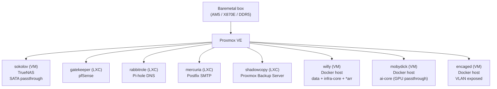
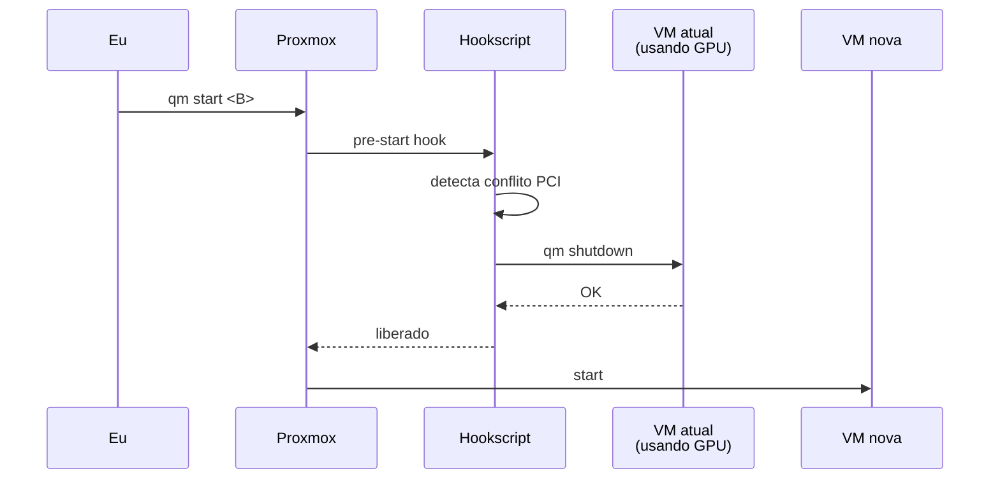

Antes de qualquer coisa rodar aqui (Honcho, LiteLLM, GitLab, *arr stack), tudo começou com **um host físico** e umas decisões que pareciam pequenas mas viraram pilares de tudo que veio depois. Esse post é sobre essas decisões, e o que eu aprendi tomando as erradas primeiro.

<!--more-->

## O hardware

Comecei com o que dava pra ter coerência por uns 5 ou mais anos. Um único box:

| Componente       | Especificação                                       |
| ---------------- | --------------------------------------------------- |
| Plataforma       | AMD AM5                                             |
| Motherboard      | MSI MPG X870E EDGE TI WIFI                          |
| Chipset          | AMD X870E                                           |
| Memória          | DDR5, 4 slots (suporta até 256 GB)                  |
| Storage HDD      | 1× Seagate IronWolf 8 TB                            |
| Storage NVMe     | 2× Samsung M.2 NVMe 2 TB + 1× Samsung M.2 EVO 500GB |
| Storage SATA SSD | 1× SSD SATA 1 TB                                    |

Decisão simples: 1 box bem dimensionado em vez de 3 mini-PCs. Mais barato por watt, mais simples de manter, e me dá rota de upgrade (até 256 GB de RAM cabem nessa placa).

A partir daí, tudo é virtualizado. O host roda Proxmox e nada mais, sem Windows no metal. Mas eu ainda quero poder usar Windows de vez em quando, então instalei ele num SSD só dele e passo o disco inteiro via passthrough pra uma VM. De quebra, como o Windows mora num disco físico próprio, dá pra dar boot direto nele (dual boot de verdade) se algum dia eu precisar da máquina crua, sem Proxmox no meio.

## Decisão 1: Proxmox em vez de baremetal puro

Eu poderia rodar Docker direto no host. Funciona. Mas:

- **Snapshot/backup atômico** de uma "máquina" inteira não existe em Docker puro do jeito que existe em VM/LXC.
- **Isolamento de rede** vira loucura de iptables. Em VM você tem NIC dedicada, controle total e ponto.
- **Passthrough de hardware** (GPU, SATA controller, USB) precisa de hypervisor pra ficar limpo.
- **Aprender** Proxmox/KVM/LXC é interessante, e me agrega uma experiência a mais em infra on-premise.

Escolhi Proxmox VE. As alternativas que descartei: ESXi (free tier morreu), Hyper-V (Windows-centric demais), libvirt cru (UI matters pra debug visual quando você tá sozinho). Não escolhi Kubernetes/k3s no nível do hypervisor porque k8s **não é hypervisor**, ele orquestra containers. Decisões diferentes, camadas diferentes. (k3s vem mais pra frente, em VMs dedicadas, falo lá no fim.)

## Camada Proxmox: como organizei

Em vez de uma VM gigante "que faz tudo", quebrei por **função**. Cada VM ou LXC tem um único papel claro:

Cada caixinha é descartável e recriável independentemente. Se o `willy` corrompe, eu restauro só ele do PBS sem mexer no resto. Esse é o ROI real da virtualização: **blast radius pequeno**.

> Pequeno easter egg: os nomes seguem um tema de jogos do Kojima: Metal Gear Solid e Death Stranding. `shagohod`, `sokolov`, `mobydick` (alias que o Kojima usou pra esconder o MGSV), `gatekeeper`... ajuda a memorizar e dá identidade. A ideia é ter nomes semânticos, que na minha cabeça fazem sentido. Em vez de puramente chamar o recurso pelo serviço rodando nele.

## Decisão 2: TrueNAS como VM, não LXC

Tentei LXC primeiro. **Erro.** O ZFS do TrueNAS quer enxergar os discos físicos, não um mount point compartilhado com o host. LXC compartilha kernel; VM não. Pra ZFS reconhecer SMART, gerenciar SAT/I-O direto, e fazer scrub honesto, ele precisa **possuir o controlador SATA**.

A solução foi passar o controlador SATA inteiro via PCIe passthrough pra VM `sokolov`. A partir desse momento, o TrueNAS é dono dos discos, o Proxmox nem enxerga mais. ZFS feliz.

Quem dera fosse só isso, com o tempo eu estava percebendo que a VM morria e meu Zpool corrompia. Isso deu uma dor de cabeça danada para resolver, coisa de dias, até realmente eu entender o que estava acontecendo. Mas no final, era simples, basicamente a ideia do NAS era que via NFS ou SMB os meus serviços compartilhassem a montagem do disco. Mas por algum motivo, o VFIO resetava o barramento durante a vida da VM, pois passthrough de SATA é burocrático. Mesmo isolando o VFIO Group, sempre o kernel resetava por algum motivo. Não achei uma solução decente para o VFIO, então, basicamente tirei o passthrough da controladora SATA, e passei o disco para VM via Proxmox, basicamente o device estava no host Proxmox e eu passava o device todo para a VM, isso não é bare metal, mas atende minha necessidade.

**Lição:** quando o software gerencia hardware (storage controller, GPU, USB), ele quer ver hardware. Não tente abstrair pra ele.

Pool atual:
- **IronWolf 8 TB** → pool principal: media, cloud sync, dados.
- **SSD SATA 1 TB** → pool secundário: cache de containers, snapshots quentes.
- **Plano**: segundo IronWolf pra mirror RAID1 quando o budget permitir.

## Decisão 3: Segmentação de rede (pfSense + VLANs)

A LAN da casa é o mesmo lugar onde mora torradeira inteligente, console, celular do seu amigo. Na verdade não queria que os serviços tivessem IPs na rede local, e como gosto de estudar segurança e praticar no homelab, queria isolar um vetor de ataque. Assumo que foi bem divertido configurar isso, eu tenho um bom background de redes, e aplicar isso ajudou a fixar alguns conceitos.

Solução: `pfSense` como LXC (`gatekeeper`), com **3 VLANs** internas (uso nomes simbólicos aqui, obviamente):

| VLAN           | Propósito                                                                                                      |
| -------------- | -------------------------------------------------------------------------------------------------------------- |
| `vlan-core`    | Infra/data/AI internos (willy, mobydick, sokolov, rabbitrole, mercuria, o joguinho de nomes que já expliquei) |
| `vlan-exposed` | Serviços remoto-acessíveis (encaged)                                                                           |
| `vlan-lab`     | Ambiente isolado pra labs e futuro cluster k3s                                                                 |

Acesso de fora:
- **LAN local** não chega nas VLANs sem passar pela `pfSense`.
- **De fora do roteador**, eu uso **Wireguard** pra entrar nas VLANs internas.
- **Serviços públicos** (GitLab, Honcho-API, etc.) saem via **Cloudflare Tunnel** com **Zero Trust**: `cloudflared` rodando no `willy`, **Nginx Proxy Manager** fazendo o reverse proxy interno. Nada exposto direto na internet.
- **DNS interno** (`rabbitrole` rodando Pi-hole) só resolve quando você está conectado via Wireguard. É proposital: domínios internos não vazam.

Esse desenho não é "elegante", é **defensivo**: se uma porta abre por engano, ela abre dentro de uma VLAN, não na rede inteira.

## Decisão 4: Passthrough de GPU rotativo (e um hookscript pra não dar tiro no pé)

Tenho uma GPU NVIDIA de linha consumer. Ela precisa servir, em momentos diferentes:

- **mobydick** quando vou rodar Ollama / ComfyUI.
- **Uma VM Windows** quando quero usar como "desktop sobre a rede" pra jogar ou rodar app que só existe no Windows.
- **Kali VM** quando vou estudar/testar algo que precisa de GPU.

Não dá pra ter GPU passthrough em duas VMs ao mesmo tempo, a placa é uma só. A primeira vez que eu iniciei a Windows com a `mobydick` ainda ligada, o Proxmox engasgou e travei a sessão, e ai tem que fazer reset, enfim, orquestrar isso na mão também não era opção.

A solução foi um **hookscript** que roda no start da VM. Ele detecta se outra VM tá segurando o device PCI da GPU, e **derruba ela antes** de subir a nova. Defensivo:

Lição que virou padrão: **automação defensiva > memória humana**. A ideia de escrever esse blog é... Vou esquecer tudo uma hora. Daqui a 6 meses eu não vou lembrar desse detalhe. O hookscript lembra. E agora o blog tem documentado.

## Decisão 5: Backup multi-camada (PBS)

Backup é uma daquelas coisas que parece chato até o dia em que salva sua vida e tudo mais. Estrutura que pensei:

- **PBS** roda como LXC (`shadowcopy`).
- **Dois datastores**:
  - `pbs-local`: no pool ZFS `zero` (NVMe 2 TB), dataset `zero/pbs`. Rápido pra restore.
  - `pbs-nas`: em **NFS exportado pelo TrueNAS**. Mais lento, mas em pool diferente, sobrevive se o NVMe morrer.
- **Sync** entre os dois datastores agendado.
- **Retention**: Keep Last + Daily + Weekly + Monthly. Dedup faz o storage caber (Tá aí uma coisa interessante para estudar...)

**Gotcha grande**: tentei montar o NFS **dentro do container** PBS. O LXC ficou com **rootfs cheio** porque o cache do NFS começou a empurrar no overlayfs. (Novamente problemas com mountpoints e blk devices... Mas essa foi simples de resolver... Na verdade foi insistência minha o erro...) Solução certa: montar o NFS **no host Proxmox** e passar pra dentro do LXC via `mp0`. Lição que vale anotar: LXC não é mini-VM, ele compartilha layers com o host.

Além do PBS, scripts rodando via `cron.daily` no host Proxmox usam o `proxmox-backup-client` pra:
- Backup **diário curado** das configs críticas.
- Backup **semanal completo** do rootfs do host com exclusões (cache, logs rotativos).

## Decisão 6: Email centralizado (mercuria)

Notificação é tudo... Mas tá aí uma coisa que me irrita, notificação descoordenada. Cada serviço precisava de uma configuração de SMTP, uma credencial e bla bla bla..Cada serviço quer mandar email de alerta. Proxmox quer mandar quando uma tarefa falha. TrueNAS quer mandar quando um disco fica suspeito. PBS quer mandar quando o GC roda. pfSense quer mandar quando um bloqueio espirra.

Em vez de configurar SMTP em **cada um** desses, montei um único LXC (`mercuria`) rodando **Postfix** como relay. Todo serviço aponta pra ele, ele faz o envio via um gateway SaaS de envio de email (Aí você pode escolher o que você achar melhor). E o `pfSense` só permite SMTP saindo de `mercuria`, qualquer outra coisa tentando 587/465 bate na parede.

Pra entrada de email, **Cloudflare Email Routing** com SPF/DKIM/DMARC configurados. (Isso foi fru fru de arquitetura, mas fiz porque queria entender alguns conceitos)

**Padrão que estou repetindo no homelab**: serviço compartilhado fica em um LXC dedicado, rede restringe quem pode falar com ele. mercuria pra SMTP, rabbitrole pra DNS, gatekeeper pra roteamento. Single responsibility até no nível de container.

## O que vem aí

Esse foi o **chão**. Tudo que rodar nesse homelab assume essas decisões. No [próximo post]() eu mostro uma das peças concretas que vivem em cima desse chão: a **memória semântica self-hosted** que liguei aos meus agents (e que foi, na prática, o que me trouxe pra escrever esse blog).

E mais pra frente da série, alguns assuntos que ficaram só citados aqui:
- **GPU passthrough via VFIO**: o que tem por baixo do `passthrough` que mencionei na Decisão 4. (Em construção.)
- **k3s na VLAN isolada de labs** pra camada de aplicação.
- **arr stack no willy** com media vinda do TrueNAS.
- **GitLab self-hosted no encaged** atrás do Cloudflare Tunnel.
- **Detalhes do PBS** (retention, GC, restore drills).

Se você tá montando algo parecido, comece pela **decisão de virtualizar** antes de qualquer container. O resto deriva daí.
