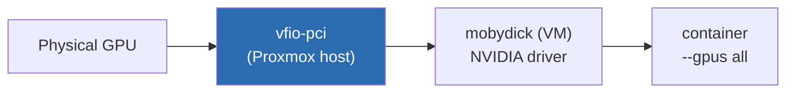

In the [first post]() I mentioned in passing that the GPU is passed to `mobydick` via VFIO, and that there's a hookscript orchestrating it. In the [self-hosted AI post]() I said "getting VFIO right gets its own post." This is that post. The goal is to dedicate a whole article to getting **GPU passthrough via VFIO** working on Proxmox: what the docs assume you already know, what breaks silently, and how to go from "the kernel complains" to "the VM sees the card and Docker inside it runs CUDA cleanly."

<!--more-->

A note on tone: this isn't a copy-paste tutorial. It's the narrative order of the scars, with the commands that matter. My hardware is AMD (AM5 / X870E), so the cmdline is the AMD flavor. On Intel, swap `amd_iommu` for `intel_iommu` and the logic is the same.

## What passthrough is, in one sentence

Passing a card via PCIe passthrough means taking control of it away from the host and handing **the entire physical device** to a VM, as if the card were plugged straight into it. The hypervisor can't be using the GPU, and the host driver can't have touched it at boot. That "can't touch it" is where 90% of the pain lives.

## Step 1: IOMMU on (BIOS + kernel)

IOMMU is what makes passthrough safe: it gives each device an isolated DMA space. Without it, none of this works.

In the AMD board's BIOS I enabled **SVM** (virtualization) and **IOMMU** (sometimes shown as "AMD-Vi"). Then, on the Proxmox kernel cmdline:

```bash
# /etc/default/grub
GRUB_CMDLINE_LINUX_DEFAULT="quiet amd_iommu=on iommu=pt"
update-grub
reboot
```

`iommu=pt` (passthrough mode) keeps the IOMMU only in the path of devices that will actually be passed through, with no overhead on the rest. After the reboot, confirm it's on:

```bash
dmesg | grep -i -e DMAR -e IOMMU
# expected: "AMD-Vi: ... IOMMU performance counters supported" and friends
```

## Step 2: the IOMMU groups (where the dream can end early)

Here's the detail most tutorials skip. You don't pass a device — you pass an **entire IOMMU group**. If the GPU shares a group with something else (a USB controller, a PCIe bridge, who knows), you'd have to pass it all together, and the castle collapses.

A script to list the groups:

```bash
for d in /sys/kernel/iommu_groups/*/devices/*; do
  n=${d#*/iommu_groups/}; n=${n%%/*}
  printf 'IOMMU Group %s: ' "$n"
  lspci -nns "${d##*/}"
done | sort -h -k3
```

What you want to see: the GPU (the VGA function `xx:00.0`) and its **HDMI audio** (`xx:00.1`) alone in a group, with nothing else. Functions of the same card in the same group is normal and expected — you pass both and move on.

If more stuff shows up in the group, the path is the **ACS override** (`pcie_acs_override=downstream,multifunction` on the cmdline). It worked here when I needed it, but I'll log the honest caveat: ACS override **weakens DMA isolation** between devices — a security trade-off you take on knowingly. In a learning homelab, fine. I avoid it when I can.

## Step 3: rip the card away from the host (vfio-pci before everyone else)

This is the key move. If the `nvidia` (or `nouveau`) driver loads at boot and touches the GPU, then when the VM tries to grab the card it comes in **dirty**, and you get an error or a reset. The fix is for `vfio-pci` to claim the card **before** any graphics driver, all the way back in the initramfs.

First find the card's `vendor:device` IDs (the `[10de:xxxx]` column — NVIDIA is always `10de`):

```bash
lspci -nnk | grep -iA3 -e VGA -e Audio
```

Note both IDs (the VGA function and the HDMI audio one). Then bind them to vfio-pci and block the graphics drivers:

```bash
# /etc/modprobe.d/vfio.conf
options vfio-pci ids=10de:XXXX,10de:YYYY
softdep nvidia pre: vfio-pci
softdep nouveau pre: vfio-pci

# /etc/modprobe.d/blacklist-gpu.conf
blacklist nouveau
blacklist nvidia
blacklist nvidiafb
```

Make sure vfio comes up early and regenerate the initramfs:

```bash
echo -e "vfio\nvfio_iommu_type1\nvfio_pci" >> /etc/modules
update-initramfs -u -k all
reboot
```

> Why `ids=` and not just pick it in the Proxmox UI? Because binding by ID guarantees `vfio-pci` is the **first** to claim the card at boot. Leaving it for the UI to sort out later is the kind of thing that works until the day modules load in a different order and hand you a reset out of nowhere.

## Step 4: confirm the card came out clean

Moment of truth. After the reboot:

```bash
lspci -nnk -d 10de:
# "Kernel driver in use: vfio-pci"  <- this is what you want
# if "nvidia" or "nouveau" shows up here, you're back to square one
```

If the driver in use is `vfio-pci` on both functions (video and audio), the card is reserved and the host is no longer touching it. You can start the VM.

## Step 5: the VM (q35, OVMF, and the consumer-card gotcha)

The config of the VM receiving the GPU has to be the right kind:

- **Machine `q35`** (modern chipset with real PCIe, not i440fx).
- **OVMF (UEFI) BIOS**, not SeaBIOS.
- **CPU `host`** (the VM sees the real processor, not an emulated generic one).
- The GPU added as a **PCI device** with **All Functions** and **PCI-Express** checked (passes video + HDMI audio together, on the PCIe slot).

And here's the consumer NVIDIA gotcha: the NVIDIA driver historically **doesn't like** running inside a VM and, on detecting it's virtualized, throws the infamous **Code 43**. The card shows up in device manager but refuses to work. The cure is to hide from the VM the fact that it is a VM:

```ini
# relevant chunk of /etc/pve/qemu-server/<VMID>.conf
machine: q35
bios: ovmf
cpu: host,hidden=1,flags=+pcid
hostpci0: <gpu-pci-id>,pcie=1,x-vga=1
```

The `hidden=1` on the CPU plus a masked hyper-v vendor-id is what makes the driver stop throwing a tantrum. In some cases of the card as **primary** you still need to **dump the vBIOS** (ROM) and point `romfile=` on the `hostpci`, but in my use (card as a secondary compute device, no monitor) that wasn't necessary.

> **Code 43 is almost always one of three things:** a graphics driver still touching the card from the host (Step 3 done wrong), the VM missing `hidden=1`, or a ROM that needs dumping. In that order of likelihood.

## Step 6: validate inside the VM, all the way to Docker

With the VM up (mine is `mobydick`, Ubuntu server, Docker only), I install the NVIDIA driver and check:

```bash
nvidia-smi
# it has to list the card, the driver version and CUDA. If it lists, you've won.
```

But `nvidia-smi` on the VM host is only half. What I want is the **container** seeing the GPU. For that, `nvidia-container-toolkit` exposes the card to Docker:

```bash
# inside mobydick, after installing nvidia-container-toolkit
docker run --rm --gpus all nvidia/cuda:12.8.0-base-ubuntu24.04 nvidia-smi
```

If that `nvidia-smi` runs **from inside the container**, the path is closed end to end: physical host → VFIO → VM → driver → container. That's the state in which the `ai-core` stack (Ollama, ComfyUI and co.) can actually use the card.



## ComfyUI on a card that's too new: the recent-CUDA case

When I went to bring up **ComfyUI** (image generation) on top of this setup, I hit a problem that isn't VFIO, but lives exactly on the same frontier of "new hardware, software hasn't caught up." My card is from a **recent NVIDIA generation** — new enough that the stable PyTorch wheels didn't properly support it yet: CUDA kernels compiled for earlier architectures simply wouldn't run on it.

The way out was to not rely on the prebuilt image and **build my own**: I started from a base with the ML dependencies, but pinned a **PyTorch built for CUDA 12.8 (`cu128`)**, which is what sees the new architecture. It's a heavy build (it downloads torch + the CUDA toolchain, takes a good few minutes on the first run), but after that ComfyUI sees the card and image inference runs locally, alongside the rest of `ai-core`.

**Lesson for new GPUs in general:** when the card is newer than the software, the problem is rarely the passthrough — it's the CUDA stack. Check the architecture your binaries support before blaming VFIO.

## The leftover conflict: one card, several VMs

With passthrough solved, an operational problem remains: there's **one** card, and it serves `mobydick` (AI), a Windows VM (when I want it as a remote desktop) and a Kali one (labs). You can't have passthrough of the same GPU on two running VMs at once, and starting the second while the first still holds the device locks Proxmox up badly.

I already told this part in [Decision 4 of the first post](#decision-4--rotating-gpu-passthrough-and-a-hookscript-so-i-dont-shoot-myself-in-the-foot): a pre-start **hookscript** detects who's holding the GPU's PCI device and takes that VM down before bringing up the new one. Defensive automation instead of human memory. I won't repeat the script here — the reasoning is over there.

## The gotchas, as a checklist

For when you (or I, six months from now) go to debug this again:

- **`Kernel driver in use` isn't `vfio-pci`** → a graphics driver touched it at boot. Review blacklist + `softdep` + `update-initramfs`.
- **Code 43 in the VM** → missing `hidden=1`, or the ROM needs dumping, or Step 3 done wrong.
- **IOMMU group with junk in it** → ACS override (knowing the isolation trade-off).
- **Reset bug / card won't come back after the VM shuts down** → the classic consumer-passthrough horror. In my SATA case this cost me days (told in [Decision 2](#decision-2--truenas-as-a-vm-not-an-lxc)); on the GPU, keeping the device always on `vfio-pci` and orchestrating with the hookscript avoids the worst.
- **Container can't see the GPU but the host's `nvidia-smi` can** → missing `nvidia-container-toolkit` / Docker runtime.
- **CUDA complains about an unsupported architecture** → not VFIO, it's the PyTorch/CUDA version. Build with the right `cuXXX`.

## What's coming in the series

This closes the **floor-and-hardware** arc: Proxmox, storage, network, self-hosted AI, and now the GPU delivered clean into the VMs. The next arc of the series goes up a layer: I left the "single Docker host" behind and moved to a **real k3s cluster**, fully provisioned as code (Terraform + Ansible), to orchestrate the applications I've been developing here. I'll start with provisioning the HA cluster in the next post.
