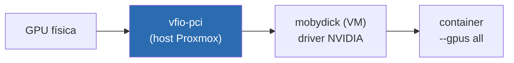

No [primeiro post]() eu mencionei de passagem que a GPU é passada via VFIO pra `mobydick`, e que tem um hookscript orquestrando isso. No [post de IA self-hosted]() eu disse que "o fluxo de configurar VFIO direito fica em post próprio". Esse é o post próprio. A ideia é dedicar um espaço inteiro ao caminho de fazer **GPU passthrough via VFIO** funcionar no Proxmox: o que a documentação assume que você já sabe, o que quebra em silêncio, e como sair do "o kernel reclama" pra "a VM enxerga a placa e o Docker dentro dela roda CUDA limpo".

<!--more-->

Aviso de tom: esse não é um tutorial copia-e-cola. É a ordem narrativa das cicatrizes, com os comandos que importam. Meu hardware é AMD (AM5 / X870E), então a cmdline é a versão AMD. Em Intel troca `amd_iommu` por `intel_iommu` e a lógica é a mesma.

## O que é o passthrough, em uma frase

Passar uma placa via PCIe passthrough é tirar o controle dela do host e entregar **o device físico inteiro** pra uma VM, como se a placa estivesse plugada direto nela. O hypervisor não pode estar usando a GPU, nem o driver do host pode ter encostado nela no boot. Esse "não pode encostar" é onde mora 90% da dor.

## Passo 1: IOMMU ligado (BIOS + kernel)

IOMMU é o que torna passthrough seguro: ele dá a cada device um espaço de DMA isolado. Sem ele, nada disso funciona.

Na BIOS da placa AMD eu liguei **SVM** (virtualização) e **IOMMU** (às vezes aparece como "AMD-Vi"). Depois, na cmdline do kernel do Proxmox:

```bash
# /etc/default/grub
GRUB_CMDLINE_LINUX_DEFAULT="quiet amd_iommu=on iommu=pt"
update-grub
reboot
```

`iommu=pt` (passthrough mode) deixa o IOMMU só no caminho dos devices que realmente vão ser passados, sem overhead no resto. Depois do reboot, confere que ligou:

```bash
dmesg | grep -i -e DMAR -e IOMMU
# esperado: "AMD-Vi: ... IOMMU performance counters supported" e afins
```

## Passo 2: os grupos de IOMMU (onde o sonho pode acabar cedo)

Aqui está o detalhe que a maioria dos tutoriais pula. Você não passa um device, você passa um **grupo de IOMMU inteiro**. Se a GPU estiver no mesmo grupo de outra coisa (um controlador USB, uma ponte PCIe, sabe-se lá), você teria que passar tudo junto, e aí o castelo desaba.

Script pra listar os grupos:

```bash
for d in /sys/kernel/iommu_groups/*/devices/*; do
  n=${d#*/iommu_groups/}; n=${n%%/*}
  printf 'IOMMU Group %s: ' "$n"
  lspci -nns "${d##*/}"
done | sort -h -k3
```

O que você quer ver: a GPU (a função VGA `xx:00.0`) e o **áudio HDMI dela** (`xx:00.1`) sozinhos num grupo, sem mais nada junto. Funções da mesma placa no mesmo grupo é normal e esperado, você passa as duas e pronto.

Se vier mais coisa no grupo, o caminho é o **ACS override** (`pcie_acs_override=downstream,multifunction` na cmdline). Funcionou aqui quando precisei, mas registro o porém honesto: ACS override **enfraquece o isolamento de DMA** entre devices, é um trade-off de segurança que você assume conscientemente. Num homelab de estudo, beleza. Eu evito quando dá pra evitar.

## Passo 3: arrancar a placa do host (vfio-pci antes de todo mundo)

Esse é o pulo do gato. Se o driver `nvidia` (ou `nouveau`) carregar no boot e encostar na GPU, quando a VM tentar pegar a placa ela vem **suja**, e você toma erro ou reset. A solução é o `vfio-pci` reivindicar a placa **antes** de qualquer driver gráfico, lá no initramfs.

Primeiro descubra os IDs `vendor:device` da placa (a coluna `[10de:xxxx]`, NVIDIA é sempre `10de`):

```bash
lspci -nnk | grep -iA3 -e VGA -e Audio
```

Anota os dois IDs (a função VGA e a de áudio HDMI). Aí amarra eles no vfio-pci e bloqueia os drivers gráficos:

```bash
# /etc/modprobe.d/vfio.conf
options vfio-pci ids=10de:XXXX,10de:YYYY
softdep nvidia pre: vfio-pci
softdep nouveau pre: vfio-pci

# /etc/modprobe.d/blacklist-gpu.conf
blacklist nouveau
blacklist nvidia
blacklist nvidiafb
```

Garante que o vfio sobe cedo e regenera o initramfs:

```bash
echo -e "vfio\nvfio_iommu_type1\nvfio_pci" >> /etc/modules
update-initramfs -u -k all
reboot
```

> Por que `ids=` e não passar só pelo Proxmox na UI? Porque amarrar pelo ID garante que o `vfio-pci` é o **primeiro** a reivindicar a placa no boot. Deixar pra UI resolver depois é o tipo de coisa que funciona até o dia que carrega numa ordem diferente e te dá reset do nada.

## Passo 4: conferir que a placa saiu limpa

Momento da verdade. Depois do reboot:

```bash
lspci -nnk -d 10de:
# "Kernel driver in use: vfio-pci"  <- isso é o que você quer
# se aparecer "nvidia" ou "nouveau" aqui, voltou tudo pra estaca zero
```

Se o driver em uso for `vfio-pci` nas duas funções (vídeo e áudio), a placa está reservada e o host não está mais mexendo nela. Pode subir a VM.

## Passo 5: a VM (q35, OVMF, e o detalhe das placas consumer)

A config da VM que recebe a GPU tem que ser do tipo certo:

- **Machine `q35`** (chipset moderno com PCIe de verdade, não i440fx).
- **BIOS OVMF (UEFI)**, não SeaBIOS.
- **CPU `host`** (a VM enxerga o processador real, sem emular um genérico).
- A GPU adicionada como **PCI device** com **All Functions** e **PCI-Express** marcados (passa vídeo + áudio HDMI juntos, no slot PCIe).

E aqui vem o pulo do gato das placas NVIDIA **consumer**: o driver da NVIDIA, historicamente, **não gosta** de rodar dentro de uma VM e, ao detectar que está virtualizado, dá o famoso **Code 43**. A placa aparece no gerenciador mas se recusa a funcionar. A cura é esconder da VM o fato de que ela é uma VM:

```ini
# trecho relevante do /etc/pve/qemu-server/<VMID>.conf
machine: q35
bios: ovmf
cpu: host,hidden=1,flags=+pcid
hostpci0: <pci-da-gpu>,pcie=1,x-vga=1
```

O `hidden=1` no CPU e o hyper-v vendor-id mascarado é o que faz o driver parar de fazer birra. Em alguns casos de placa como **primária** ainda é preciso fazer o **dump da vBIOS** (ROM) e apontar `romfile=` no `hostpci`, mas no meu uso (placa como secundária de compute, sem monitor) isso não foi necessário.

> **Code 43 é quase sempre uma de três coisas:** driver gráfico ainda encostando na placa pelo host (Passo 3 mal feito), VM sem o `hidden=1`, ou ROM que precisa ser dumpada. Nessa ordem de probabilidade.

## Passo 6: validar dentro da VM, até o Docker

Com a VM no ar (a minha é a `mobydick`, Ubuntu server, só Docker), instalo o driver da NVIDIA e confiro:

```bash
nvidia-smi
# tem que listar a placa, a versão do driver e o CUDA. Se listar, ganhou.
```

Mas `nvidia-smi` no host da VM é só metade. O que eu quero é o **container** enxergando a GPU. Pra isso, o `nvidia-container-toolkit` expõe a placa pro Docker:

```bash
# dentro da mobydick, depois de instalar o nvidia-container-toolkit
docker run --rm --gpus all nvidia/cuda:12.8.0-base-ubuntu24.04 nvidia-smi
```

Se esse `nvidia-smi` rodar **de dentro do container**, o caminho está fechado de ponta a ponta: host físico → VFIO → VM → driver → container. Esse é o estado em que o stack `ai-core` (Ollama, ComfyUI e cia) consegue usar a placa de verdade.



## ComfyUI numa placa nova demais: o caso do CUDA recente

Quando fui subir o **ComfyUI** (geração de imagem) em cima desse setup, bati num problema que não é VFIO, mas que mora exatamente na mesma fronteira de "hardware novo, software ainda não acompanhou". Minha placa é de uma **geração recente da NVIDIA**, nova o bastante pra que os wheels estáveis do PyTorch ainda não a suportassem direito: kernels CUDA compilados pra arquiteturas anteriores simplesmente não rodavam nela.

A saída foi não depender da imagem pronta e **buildar a minha própria**: parti de uma base com as dependências de ML, mas fixei um **PyTorch compilado pra CUDA 12.8 (`cu128`)**, que é o que enxerga a arquitetura nova. É um build pesado (baixa torch + toolchain CUDA, leva uns bons minutos no primeiro run), mas depois disso o ComfyUI passa a ver a placa e a inferência de imagem roda local, junto do resto do `ai-core`.

**Lição que vale pra GPU nova em geral:** quando a placa é mais nova que o software, o problema raramente é o passthrough, é a stack CUDA. Confere a arquitetura suportada pelos binários antes de culpar o VFIO.

## O conflito que sobra: uma placa, várias VMs

Resolvido o passthrough, sobra um problema operacional: a placa é **uma só**, e ela serve `mobydick` (IA), uma VM Windows (quando quero usar como desktop remoto) e uma Kali (labs). Não dá pra ter passthrough da mesma GPU em duas VMs ligadas ao mesmo tempo, e subir a segunda com a primeira ainda segurando o device trava o Proxmox feio.

Esse pedaço eu já contei na [Decisão 4 do primeiro post](#decisão-4-passthrough-de-gpu-rotativo-e-um-hookscript-pra-não-dar-tiro-no-pé): um **hookscript** de pre-start detecta quem está segurando o device PCI da GPU e derruba aquela VM antes de subir a nova. Automação defensiva no lugar de memória humana. Não vou repetir o script aqui, o raciocínio está lá.

## Os gotchas, em forma de checklist

Pra quando você (ou eu, daqui a 6 meses) for debugar isso de novo:

- **`Kernel driver in use` não é `vfio-pci`** → driver gráfico encostou no boot. Revisa blacklist + `softdep` + `update-initramfs`.
- **Code 43 na VM** → falta `hidden=1`, ou ROM precisa de dump, ou Passo 3 mal feito.
- **Grupo de IOMMU com tralha junto** → ACS override (sabendo do trade-off de isolamento).
- **Reset bug / placa não volta depois de desligar a VM** → o assombro clássico do passthrough de consumer. No meu caso de SATA isso me custou dias (contei na [Decisão 2](#decisão-2-truenas-como-vm-não-lxc)); em GPU, manter o device sempre no `vfio-pci` e orquestrar com o hookscript evita o pior.
- **Container não vê a GPU mas `nvidia-smi` do host vê** → falta `nvidia-container-toolkit` / runtime do Docker.
- **CUDA reclama de arquitetura não suportada** → não é VFIO, é a versão do PyTorch/CUDA. Build com a `cuXXX` certa.

## O que vem na série

Esse fechou o arco do **chão e do hardware**: Proxmox, storage, rede, IA self-hosted e agora a GPU entregue limpa pra dentro das VMs. O próximo arco da série sobe uma camada: saí do "host Docker único" e fui pra um **cluster k3s de verdade**, todo provisionado como código (Terraform + Ansible), pra orquestrar as aplicações que ando desenvolvendo aqui. Começo pelo provisionamento do cluster HA no próximo post.
